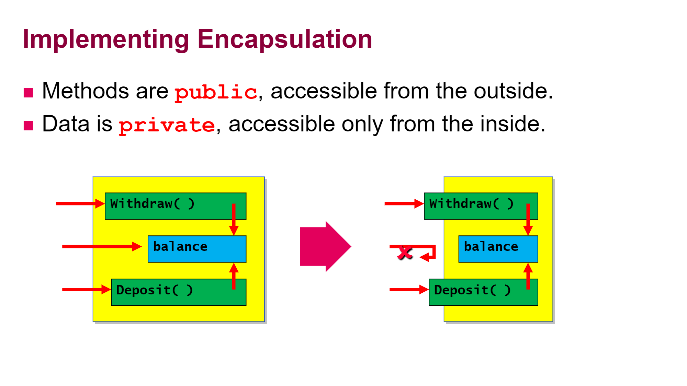
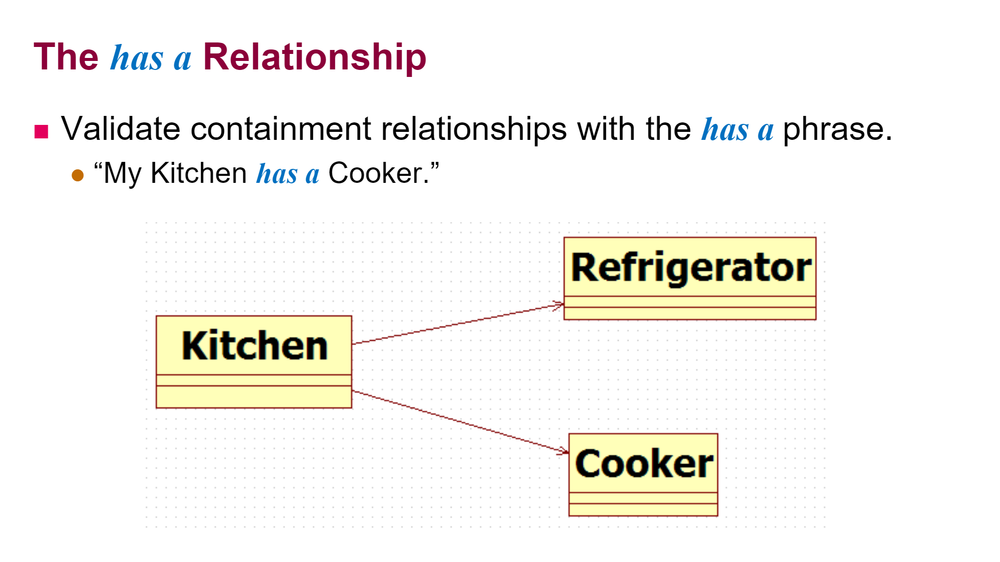

08/03

# Chapter 6. OOP

## 클래스

클래스는 객체의 설계도 또는 틀이라고 생각하면 된다.

A data structure that includes both data and functions.

- 정의 : 객체를 정의해놓은 것.
- 용도 : 객체를 생성하는데 사용된다.


## 객체와 인스턴스

### 객체

객체는 책상과 같이 우리가 주변에서 볼 수 있는 유형적인 사물뿐만 아니라, 개념이나 논리와 같은 무형적인 것들도 포함된다.

프로그래밍에서 객체는 **클래스에 정의된 내용대로 메모리에 생성된 것**을 뜻한다. 

- 정의 : 실제로 존재하는 것. 사물 또는 개념
- 용도 : 객체가 가지고있는 기능과 속성에 따라 다름


인스턴스화(instantiate) : 클래스로부터 객체를 만드는 과정

클래스의 인스턴스 : 클래스로부터 만들어진 객체


> 책상은 객체다. (책상은 인스턴스다. X)
>
> 책상은 책상 클래스의 인스턴스다. (책상은 책상 클래스의 객체다. X)


객체는 `속성과 기능의 집합`이다. 그리고 객체가 갖고 있는 속성과 기능을 그 객체의 멤버(구성원, member)라고 한다.

속성과 기능은 같은 뜻의 여러 용어가 있으며 앞으로는 속성과 기능을 다음과 같이 부를 것이다.

### 속성(Attribute) = 멤버변수(member variable), 필드(field)

변수, 상수, 가격, 이름, 키, 몸무게

### 기능(Operation) = 메서드(method), 함수(function)

Car.go(), Car.stop() 괄호가 있음!


객체의 4가지 특징

1. Abstraction
2. Encapsulation
3. Inheritance
4. Polymorphism 
   - 형태가 변한다.
   - 상속이 선행돼야한다.

# 1. Abstraction 추상화. 

   1. TV의 속성과 기능을 어떻게 만들지?
   2. 무엇이 중요한지 결정 & 집중
   3. 실제 물체를 추상화(Abstraction, 모델링)한다.
   4. UML Tool을 이용한다.

# 2. Encapsulation 캡슐화

   1. 클래스 숨기기 + 기능제한! The priciple of protecting sensitive parts of objects from external manipulation

   2. 은행계좌 예시 : withdraw(), deposit()은 public으로 열어두고 balance는 private으로 잠궈둔다.

      

   3. 멤버(속성,기능)를 `접근제어자` private으로 설정해주는 것이 캡슐화다. (접근권한 주고싶을 땐 public)

      접근제어자는 public, protected, (default), private이 있고, 대상에 따라 사용가능한 접근제어자가 다르다.

      > 클래스 : public, (default)
      >
      > 메서드/멤버변수 : public, protected, (default), private
      >
      > 지역변수 : 없음

   4. **모든 변수는 private으로 설정하자**  

   5. 변수들에 접근하고싶으면 **get / set 메소드**를 이용한다. 

      ```java
      public class EncapDemo1 {
      	public static void main(String[] args) {
      		Student chulsu = new Student();
      		chulsu.setKor(110); // class Student에 public void setKor(int score) 있음
      		int kor = chulsu.getKor();
      		if(kor >= 0) System.out.println("국어 : " + kor);
      		else System.out.println("error");
      	}
      }
      ```

      Eclipse에서 Source > Generate Getters and Setters 누르면 원하는 변수에 대해 자동생성된다!

      

   7. UML에서는 Visibility 를 통해 private / public 변경가능


---

08/04


# 생성자 (Constructor)

definition : 인스턴스가 생성될 때 호출되는 인스턴스 초기화 메서드. 인스턴스 변수의 초기화에 주로 사용된다.

건물을 생성하는 역할을 하는 애


#### 객체를 만드는 과정

1. Allocating memory

   - Use **new** keyword to allocate memory from the heap (C언어에서 malloc)
   - new는 자동적으로 기본 생성자(default constructor)를 call한다.
2. Initialize the object by using a **constructor**
   - Use the name of the class followed by `parentheses : ()`.

    ```java
    Date when = new Date();
    ```


### 생성자의 특징

이름이 클래스와 똑같음

괄호 안에 들어가는 것에 따라 역할 바뀜 - 그동안은 항상 default constructor만 사용함

리턴타입 없음

객체를 만들때만 사용됨


## 오버라이딩 Overriding

상위 클래스가 가지고있는 메소드를 하위 클래스가 재정의해서 사용한다.

상속 관계에 있는 클래스간에 같은 이름의 메소드를 정의하는 기술을 오버라이딩이라고 한다.


```java
class Calendar{
	int year, month, day;
	public Calendar() { // 생성자 재정의. Overriding the Default Constructor
		this.year = 2020;
		this.month = 8;
		this.day = 4;
	}
	
	public Calendar(int year, int month, int day) { // 기본생성자 overloading
		this.year = year;
		this.month = month;
		this.day = day;
	}
}
```


만약, 오버라이딩 없이 오버로딩을 통해 생성자를 만들면 `Calendar()`라는 생성자가 없기 때문에 

`Calendar c = new Calendar();` 를 입력 시 컴파일에러가 발생한다. 


## 소멸자 Destructor

garbage collector가 활성화될때, 즉 해당 객체의 주소와 연결이 끊겨서 이를 삭제할 때 소멸자가 실행된다.

```java

public class DestructorDemo {
	public static void main(String[] args) {
		Box1 box = new Box1();
		// java.lang.Object 가 모든 클래스의 부모 클래스
		// box. 하면 나오는 메소드들은 Object 클래스의 메소드!!!
		box = null;
		System.gc(); // box가 필요없어졌으니까 finalize 실행된다.
	}
}

class Box1{
	public Box1() { // Overriding constructor
		System.out.println("객체 생성됨");
	}
	
	// Object.finalize() 는 protected method기때문에 main 클래스에서 사용하면 안됨. 
	protected void finalize() { // destructor
		System.out.println("객체 소멸됨");
	}
}
```


파일 저장 후 ctrl shift o 누르면 import 알아서 해줌

변수이름 한번에 바꾸려면 드래그 후 alt shift r

UML에서 static 변수는 underline 해준다.

constructor는 c표시가 생성됨. StarUML에서 constructor 생성을 위해서는 stereotype에 constructor 입력

`멤버`는 메서드와 인스턴스 모두를 일컫는 말이다. 

> ex. 클래스 변수는 멤버들이 모두 접근할 수 있다.


## 변수 초기화

지역변수는 사용하기 전 반드시 초기화해야한다.

멤버변수(클래스 변수, 인스턴스 변수)의 초기화 방법은 지역변수와 다르게 여러가지 방법이 있다.

순서 : **기본값 -> 명시적 초기화 -> 초기화블럭 -> 생성자(인스턴스변수만)**


- 명시적 초기화

  ```java
  private String name = "소나타";
  ```

- 생성자

  ```java
  private String name;
  public Car(String name){
      this.name = name;
  }
  ```

  클래스 변수는 생성자가 초기화할 수 없다. 생성자가 호출되기도 전에 이미 클래스변수가 초기화돼있다.


- 초기화 블럭
  - 인스턴스 초기화 블럭 : 인스턴스 변수 초기화에 사용 (잘 사용되지 않음)
  - 클래스 초기화 블럭 : 클래스변수(static) 초기화에 사용

### 초기화 블럭


```java
class Car(){
    String name;
    static int count;
	// 인스턴스 초기화 블럭
    {
        this.name = "소도안타";
    }
    
    // 클래스 초기화 블럭
    static {
        count = 10;
    }
}
```


# this

this는 인스턴스 자신을 가리키는 참조변수로, 인스턴스의 주소가 저장돼있다.

```java
class Student{
    private int kor; // this.kor
    public void setKor(int kor){
        this.kor = kor; 
    }
}
```

그래서 this.method1, this.variable1 등으로 객체의 인스턴스 메서드와 인스턴스 변수를 호출할 수 있다.

this만 쓰면 객체의 주소가 저장돼있고

this()를 이용하여 객체의 또다른 생성자를 호출할 수 있다.

이 때, this(Object) 앞에 어떤 것도 오면 안된다.

```java
public class Student{
	private String name;
	private int age;


	public Student() {
		this("Unknown", 20);
	}
	
	public Student(String name) {
		// this.name = name;
		this(name, 20);
	}

	public Student(int age) {
		// this.age = age;
		this("Unknown", age);
	}

	public Student(String name, int age) {
		this.name = name;
		this.age = age;
	}
}
```


08/05

### file 경로설정

```java
import java.io.File;
java.io.FileNotFoundException;
// ...
File file = new File("./data.dat");
try {
    this.scan = new Scanner(file);
} catch (FileNotFoundException e) {
    JOptionPane.showMessageDialog(null, "파일을 찾을 수 없습니다.");;
}

```


### 정규식을 이용해 파일 읽기 (Java)

[링크](https://offbyone.tistory.com/400)

```java
String line = this.scan.nextLine(); // 박지민	178.3	72.4	34
String[] dataArray = line.split("\\s+");
double height = Double.parseDouble(dataArray[1]);
double weight = Double.parseDouble(dataArray[2]); // "72.4" --> 72.4
int age = Integer.parseInt(dataArray[3]);
Account acc = new Account(dataArray[0], height, weight, age);

```


# Chapter 7. OOP 2

# 상속 (Inheritance)

기존의 클래스를 재사용하여 새로운 클래스 작성하는 것을 상속이라고 한다.

```java
class Child extends Parent { ... }
class ViolinPlayer extends Musician { ... }
```

조상 클래스 : 부모 클래스, **상위(super)** 클래스, 기반(base) 클래스

자손 클래스 : 자식 클래스, **하위(sub)** 클래스, 파생된(derived) 클래스


단일 상속(Single inheritance) : 자식 1개가 상위클래스 1개를 상속받음

다중 상속(Multiple inheritance) : 자식 1개가 2개 이상의 상위클래스를 상속받음. (자바는 이거 안함)


자바는 단일상속만 한다.


## (중요한) 상속되지 않는 4가지 경우

결국 이 4가지를 하나씩 까면 다음 목차(super(), overriding)가 된다.

- private 접근 제한 > getter setter 메소드를 상속받으니까 그걸로 불러오면 된다.
- 생성자와 초기화블럭은 상속되지 않는다. > super() 이용
- static 은 상속되지 않는다. > 전역변수니까
- 부모클래스와 같은 이름의 변수,메소드는 상속되지 않는다. > overshadow,  override


---

08/06

동종 상속 vs 이종 상속

| 자식 | 부모 | 상속방법 | 종류 |
| :--: | :--: | :--: | :--: |
| class | class | extends | 동종 상속 |
| class | interface | implements | 이종 상속 |
| interface | interface | extends | 동종 상속 |


---

#### is-a relationship

extends 는 is a(an) 으로 바꿨을 때 말이 된다. 

SportsCar extends Car(extends Object) -> SportsCar is a Car.

UML에서 superclass를 위에 sub(상속받는) 클래스는 아래에 그린다.


#### has-a relationship

참조관계는 UML에서 가로로 그려준다.



## super()

보통 encapsulation할 때 모든 변수는 private으로 선언하는데, private 변수는 상속할 수가 없다.

그러면 어떻게하느냐..!? 생성자로 접근하면되지~

상속되지 않는 자원들

- private 접근 제한자가 붙은 자원

- static 붙은 자원

- 초기화 블럭

- 부모클래스와 같은 이름의 변수는 overshadow, 메소드는 override 된다. (추후 설명)

- 생성자

  - 자식클래스의 `어떤` 생성자든 (default로) 부모의 **기본 생성자**를 호출한다.

  - 자식클래스는 생성자의 입력인자가 여러 개 있어도 자식객체 생성시 부모의 기본생성자를 호출한다.

  - 그렇기때문에 부모의 기본생성자를 `명시적으로` 만들어줘야한다.

    ```java
    // 왜냐면 모든 생성자 맨 앞에는 super()가 생략돼있음.
    // super()는 자식의 부모의 기본생성자를 호출하는 명령어
    // this()와 super()는 생성자에만 위치해야한다.
    // 첫줄에 위치해야한다. 그래서 둘은 같이 쓸 수 없음
    
    public class InheritanceDemo1 {
    	public static void main(String[] args) {
    		Child child1 = new Child(); // 부모클래스를 만든 후에 자식클래스가 만들어진다.
    		Child child2 = new Child(24); // 자식의 기본생성자 아니여도 부모의 기본생성자 호출
    	}
    }
    
    class Parent{
    	public Parent() { // 이거없으면 Child에서 에러
    	    System.out.println("부모클래스 생성완료");
        } 
        public Parent(int age) { System.out.println("부모클래스 생성완료2");}
    }
    
    class Child extends Parent{
    	public Child() { 
            super(); // 안써도 컴파일하면 생김
            System.out.println("자식클래스 생성완료"); 
        }
    	public Child(int age) { 
            super(50); // 이런것도 된다!!
            System.out.println("자식클래스 생성완료2"); 
        }
    }
    
    ```

    


##  (핵중요!) 오버라이드 Override

조상 클래스로부터 상속받은 메서드의 내용을 변경하는 것을 오버라이딩한다고 한다.

Annotation을 써줌으로서 다른 사람과 컴파일러에게 "나 오버라이딩할거예요!"라고 말해준다.

```java
class Point{
    int x;
    int y;
    
    String getLocation(){
        return "x :" + x + ", y : " + y;
    }
}

@Override
class Point3D extends Point{
    int x; //overshadow
    int z;
    
    String getLocation(){ // Overriding
        return "x :" + x + ", y : " + y + ", z : " + z;
    }
}
```


> 내가 헷갈려서 쓰는 메모 : Overriding, Overloading
>
> Overriding : 다른 클래스에서 같은 메소드 이름을 쓰는 것. 이름, 매개변수, 반환타입 같아야함.
>
> Overloading : 같은 클래스에서 return type 또는 parameter를 다르게 설정하여 같은 메소드 이름을 쓰는것.


### 문자열 포맷팅

```java
@Override
public String toString(){ // Source > Generate toString()으로 쉽게 만들 수 있다.
	return String.format("이름은 %s입니다%n", "Pray"); // 이름은 Pray입니다. %n도 엔터됨
}


```


---

08/07

자바는 단일상속만 허용하여 코드를 더욱 신뢰할 수 있게 만들어준다.


# 다형성 Polymorphism

다형성은 여러가지 형태를 가질 수 있는 능력을 의미한다.

어떤 클래스를 갖냐에 따라 행위(기능,메서드)가 달라지는 것이다.

> 객체의 형변환과 오버라이딩으로 코딩하는 것을 다형성이라 한다.


용어 :

좌측의 Dog d가 new Dog()를 **참조한다.**

참조변수 m이 참조하고있는 인스턴스는 Dog타입이다.

 

```java
Dog d = new Dog();
Mammal m = new Dog(); // up-casting. 자식 인스턴스가 조상 인스턴스가 된다.

// 하지만 m은 Mammal타입이기때문에 Dog.bark()등을 사용할 수 없다.
// Dog d = new Mammal(); // error 발생
```

- d와 m은 같은 타입(Dog)의 인스턴스지만 참조변수의 타입(Dog, Mammal)에 따라 사용할 수 있는 멤버의 개수가 달라진다.
- Mammal m = new Dog()의 경우, 참조변수 m은 Dog 클래스에만 있는 멤버를 사용할 수 없다.
- d(자손타입의 참조변수)로 Mammal(조상타입의 인스턴스)을 참조하는 것은, 존재하지않는 멤버(bone, bark())를 사용할 가능성이 있으므로 **허용하지 않는다.**

- 결과적으로 참조변수(좌변)가 사용할 수 있는 멤버의 개수는 인스턴스(우변)의 멤버개수보다 작거나 같아야한다.

#### 조상타입의 인스턴스를 자손타입의 참조변수로 참조하는 것은 허용되지 않는다.

인스턴스 자체가 자손타입 인스턴스인데 조상으로 형변환했다면 가능하겠지만 애초에 조상타입의 인스턴스라면 불가능


## 형변환

참조변수도 형변환이 가능한데 서로 상속관계에 있는 클래스 사이에서만 가능하다.


### upcasting 

자식 -> 조상. 형변환 생략가능

> double d; int i = 9; //올바른 예는 아니다. 자손이 아니니까. 둘의 조상클래스는 Number
>
> d = i; // (double)이 생략 가능했던것처럼 생략가능

**조상타입의 참조변수로 자손타입의 인스턴스를 참조할 수 있다.**

```java
Car car = null;
FireEngine fe1 = new FireEngine(); 
FireEngine fe2 = new FireEngine();

car = fe1; // Upcasting. car = (Car)fe; 에서 형변환 생략
fe2 = (FireEngine)car; // Downcasting.
// fe2 = car; 는 에러. 형변환생략하면 안된다.
```


### downcasting 

조상 -> 자식. 형변환 생략불가능

재밌는 점은, 업캐스팅되었던 history가 있어야 다운캐스팅이 가능하다.

```java
Mammal m = new Mammal();
Korean ko = new Korean();
// Korean extends(is a) Mammal.

m = (Mammal)ko; //upcasting
m.saySomething(); // 안녕

ko = (Korean)m; //downcasting

```

만약 바로 downcasting하려고하면 에러가 발생한다.

```java
Mammal m = new Mammal();
Dog d = new Dog();

d = (Dog)m; // 여기에서 error
```


downcasting하려면, 조상 참조변수가 null을 가리키고 있다가 자손 인스턴스를 참조해야한다.

만약 조상 참조변수가 **조상 인스턴스**를 참조하고있을 때 그 인스턴스를 downcasting하는건 불가능하다.


## instanceof

instanceof는 관계연산자.

참조변수가 참조하고있는 인스턴스의 **실제 타입**을 알아보기위해 instanceof 연산자를 사용한다.

왼쪽에는 참조변수, 오른쪽에는 타입(또는 클래스명)이 위치한다. 연산결과는 boolean이다.


연산결과 true라면 참조변수가 **검사한 타입으로 형변환이 가능하다**는 것을 뜻한다.

```java
Object obj = new Object;
if (obj instanceof String) System.out.println("형변환 가능");
else System.out.println("형변환 불가능");
```


## 매개변수의 다형성

```java
class Product{}
class Tv extends Product{} 
class Computer extends Product{}
class Audio extends Product{}

class Buyer{
    void buy(Product p){} // 매개변수에 Product를 상속한 Tv, Audio 형 자료도 들어갈 수 있다.
}
```


## 배열과 다형성 - Heterogeneous Collection

```java
//Heterogeneous Collection
Car[] array = new Car[4];

array[0] = new Matiz("Silver Matiz");
array[1] = new Sonata("Black Sonata");
array[2] = new Carnival("White Carnival");
```


# 제어자

제어자는 클래스, 변수 또는 메서드의 선언부에 함께 사용되어 부가적인 의미를 부여한다. 접근제어자와 그 외의 제어자로 나뉜다.

접근 제어자 : public, protected, default, private

그 외 : static, final, abstract, ...


## final

클래스, 메서드, 멤버변수, 지역변수에 사용될 수 있다.

- 클래스에 사용되면 변경될 수 없는 클래스, 확정될 수 없는 클래스가 된다. 즉 더이상 상속이 되지 않는다.

- 메서드에 사용되면 변경될수 없는 메서드로 오버라이딩될 수 없다.

- 변수앞에 사용되면 더이상 값을 변경할 수 없는 상수가 된다.


상수 (final이 붙은 variable) 초기화하기

```java
final double PI; // instance constant
public FinalDemo() { // 인스턴스변수는 생성자를 이용해 초기화
    this.PI = 3.14;
}

static final int MAX_SIZE; // class constant
static { // 클래스 변수는 모두(상수도) 초기화 블럭을 이용해 초기화
    MAX_SIZE = 90;
}

void method(){
    final String NAME = "한지민"; // local constant
}
```


---

instanceof 용법을 복습하자