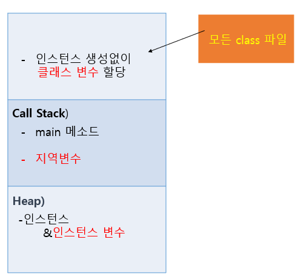

7/15

# PC 포맷

a.k.a. Windows 초기화  
window + R > cmd 

```
ipconfig
ipconfig /all
```

총 5줄 필요 : IP, 서브넷 마스크, 게이트웨이, DNS서버(2줄)을 얻어서 직접 입력해줘야한다.


## 포맷 후 행동

1. 윈도우업데이트
   window > 설정 > 윈도우업데이트  
2. 프로그램 제거 또는 변경
   window+r > appwiz.cpl > McAfee 제거    

OOP --> CBD (Component Based Development) --> SOA(Service Oriented Architecture)  
Java로 OOP개념을 잡고, Spring할 때 CBD방법 사용. 이 때 RestfulAPI 활용 예정  


# 자바의 정석 3rd Edition

# Chapter 1. 자바를 시작하기 전에

## 자바란?

Java는 오라클 + IBM + Sun이 만든 언어. 이후 오라클이 Sun을 인수함.  
Oracle Java : 오라클 정품 자바  
OpenJDK : 오픈소스인데 개발 책임이 오라클한테 있음  
**Java SE = Oracle Java + OpenJDK**

마케팅 관점에서 Java

- Java SE : Standard Edition (Core Java)
- Java EE : Enterprise Edition
- Java ME : Micro Edition

자바로 프로그래밍을 하기 위해선 Java Developer Kit (JDK)가 필요하다.  
자바(또는 자바로 만든 프로그램)를 실행하려면 Java Runtime Environment(JRE)가 깔려있어야한다.  
JRE는 개발하기 위한 프로그램이 아닌, 실행을 가능하게 하는 역할만 갖고 있다. Java Developer Kit가 있어야 개발을 할 수 있다.  즉, JRE는 소비자용, JDK는 개발자용이다.  
JDK를 설치하면 JRE가 포함되어있다.  
**JDK = JDK + JRE**

애초에 윈도우는 소비자가 쉽게 쓰기 위한 OS, 개발을 위한 OS는 Linux Mac.  
윈도우에는 JRE가 없고, 나머지에는 JRE가 있음. (오라클이랑 MS가 사이안좋아서)


## 자바 (JDK + JRE) 설치방법

참고링크 : http://codechobo.com

openjdk : https://openjdk.java.net/ 에서 아래 링크 클릭  
jdk 14 : https://jdk.java.net/14/ > 여기서 Windows : zip 다운로드  
압축해제 후, C:\Program Files 로 옮겨준다 -> C:\Program Files\jdk-14.0.2

> 윈도우는 기본적으로 다운로드된 파일의 위치가 Program Files다.


## 자바를 실행하기 위한 환경설정

window + r > SystemPropertiesAdvanced > 환경 변수

> 사용자 변수 : 사용자에 따라 다른 환경 변수  
> 시스템 변수 : 같은 컴퓨터를 쓰는 사람들이 공유하는 환경 변수

시스템 변수 > 새로 만들기 > 변수 이름: JAVA_HOME, 변수값 : jdk-14.0.2의 위치 (C:\Program Files\jdk-14.0.2)  
시스템 변수 > Path > 편집 > 새로 만들기 > %JAVA_HOME%\bin

> JAVA_HOME : 자바를 실행할 때 참조하는 자바 위치(자바를 설치했다면 생김)  
> 시스템 변수를 재활용할 때는 %MySystemVariable%, 이를 이용해 Path에 추가해줌.  
> 우선순위가 있으므로, Path 내에서  JAVA_HOME을 맨 위로 올려주면 먼저 탐색한다.

## 환경설정 확인

window + r > cmd

```
echo %JAVA_HOME%
echo %PATH%
javac --version
java --version
```

## JDK 14 Documentation (Java API문서)

오라클에서 다운로드 : https://www.oracle.com/downloads/  
압축해제 후, C:\Program Files\jdk-14.0.2 로 옮겨준다. -> C:\Program Files\jdk-14.0.2\docs  
온라인 문서 : https://docs.oracle.com/en/java/javase/14/docs/api/index.html   

> firefox를 북마크용으로 사용  
> documentation은 다운받은 후, 로컬 경로를 북마크에 저장

## Hello Java

```java
// HelloWorld.java
public class HelloWorld{
	public static void main(String [] args){
		System.out.println("Hello, World");
	}
}
```

메모장으로 코딩할 때, 확장자는 모든 파일(*.*), 파일명은 클래스 이름(HelloWorld.java)과 똑같이 설정한다.

### 실행

window + r > cmd > cd D:\JavaHome

```
> javac HelloWorld.java ------> 컴파일
> dir                   ------> 생성된 클래스 HelloWorld.class 확인
> java HelloWorld       ------> Hello, World 출력
```

## JVM

Java virtual machine. 자바를 실행하기 위한 가상 기계다. 머신은 영어권에서 컴퓨터를 부르는 말이다. JRE는 JVM 안에 설치돼있다.  
자바로 작성된 애플리케이션은 모두 JVM에서만 실행된다. 쉽게 말해, JVM은 통역사고, 여행갔을 때 통역사에게 이야기를 한다고 생각하면 된다. (반면 C언어는 직접 언어를 공부해서 여행에서 써먹는것이다. )  
실행 시 해석(interpret)되기때문에 속도가 느리다는 단점을 갖고 있다.  느려서 게임이나 GUI는 못 만든다.  
하지만 멀티플랫폼이다. 어디서든 JVM만 있다면 실행가능!  
**Write Once, Run Anywhere!**


## 기타

복종순  

- javaexpert@nate.com
- github.com/swacademy

책
남궁성 - 자바의 정석 3rd Edition (수업교재)  
<추천> 전병선 - 객체지향 이야기 (구글 도서관)


숙제

1. 컴퓨터(노트북) 사양 : OS, CPU, Memory, HDD
2. 자기소개서(+프로그래밍 경험), 강사에게바라는 점 + 피드백
3. java 설치 후, 캡쳐

```
java --version
javac --version
Javadoc API 다운로드 후, 북마크한것
```


-------


## HelloWorld 뜯어보기

```java
import java.lang.*; // 소스코드에 넣지 않아도, 필요하면 컴파일러가 자동으로 만들어냄
public class HelloWorld{
	public static void main(String [] args){
		System.out.print("한글 출력도 가능? "); // 줄 안바꿈
		System.out.println("한글 출력도 가능!"); // 줄바꿈
	}
}
```

.은 무엇의 아래에 있다는 뜻 (c언어 기준)  
Module = java.base  
Package = java.lang : 중국집, 치킨집 등 카테고리  

HelloWorld : 이름

void : return하는 값이 없다.

main(){} : 프로그램의 시작과 끝
[링크: java.lang에 속해있는 클래스 System에 대한 설명](file:///C:/Program%20Files/jdk-14.0.2/docs/api/java.base/java/lang/System.html) `클래스명의 첫 글자는 대문자 and 명사`

out : static PrintStream type. The "standard" output stream  
println(String x) : void type. prints a string and then terminate the line.

```
> javac HelloWorld.java  
> java HelloWorld  
한글 출력도 가능? 한글 출력도 가능!  
```

`java HelloWorld` 실행 시, 하드디스크에 있는 HelloWorld.class를 메모리에 로드한다. 이후에 클래스 파일의 형식과 악성코드유무 여부를 체크하고, 모두 통과했을 때 main()을 호출한다!
public class이면서 main함수를 갖고 있는 class의 이름으로 파일명을 저장해야한다.  
하나의 파일에 클래스가 여러개 있으면, 컴파일 시 각 클래스마다 클래스파일이 생겨서 이상해진다. one file, one class가 원칙

## EditPlus

메모장+cmd는 불편하므로, 자바는 EditPlus 이용

다운로드링크 : [editplus](https://www.editplus.com/)  

Tools > Preferences에서 Fonts, Templates 수정


User tools 설정하기 - Group Name : Java  
Tool 1

- Menu text : Java Compiler  
- Command : javac.exe (위치 찾아서)  
- Argument : $(FileName)
- Initial directory : $(FileDir)
- Action : Capture output >>>> cmd창을 캡쳐해서 보여주는것!

Tool 2

- Menu text : Java Run
- Cmd : java.exe
- Argument : $(FileNameNoExt) // 파일이름 확장자 없이

```Java
/*
작성자 : 
작성목적 :
작성일시 :
작성환경 : OS, Version, Editor
*/

public class Test {
	public static void main(String[] args) {
		System.out.print("Core Java -> ");
		System.out.print("Oracle -> ");
		System.out.print("JDBC -> ");
		System.out.println("1차 프로젝트");
	}
}

```

이후, Ctrl + 1 누르면  `javac.exe Test.java`  
Ctrl + 2 누르면 `java.exe Test`


## Java의 특징

1. 운영체제에 독립적이다.
2. 객체지향언어다.
3. C++에 비해 비교적 배우기 쉽다.
4. 자동 메모리 관리 (Garbage Collection)
5. 네트워크와 분산처리를 지원한다.
6. 멀티쓰레드를 지원한다.
7. 동적 로딩(Dynamic Loading)을 지원한다.

### 컴파일러 (Compiler)

- 컴파일이란 소스코드에서 목적코드로 옮기는 것으로, 실행가능한 파일이 생성된다.
- 컴파일 언어로는 C-language, Java, C# 가 대표적이다.
- CPU에 맞도록 컴파일한다는 특징이 있어, CPU에 종속적이다.
- Java 는 특이하게 CPU에 종속되지 않도록 노력했지만 느리다.

### 인터프리터 (Interpreter)

- 번역과 실행을 동시에 한다.
- 소스코드를 한줄씩 읽으면서 실행하는 프로그램
- CPU에 종속되지 않는다.
- 인터프리터형 언어는 script 언어로, html5, css, JS, Ajax, jQuery, SQL, python이 있다.

## 진법

똑같은 10101111을 데이터 타입에 따라 다르게 읽을 수 있다.  
4개씩 짜르면 16진수.  
두 수의 빼기는 맨앞 숫자를 바꾼 후 연산해준다.  

- 27.42(8) = 010111.100010(2) = 23+0.5+1/32
- AF.8(16) = 10101111.1000(2) = 175.5 
- 100101101.0110101(2) = 12D.6A(16)
- 2F360(16) = 00101111001101100000(2) = 571540(8)
- 571(8) = 0000 0001 0111 1001(2)

## 기타

금주의 목표 : 프로그래밍에 대한 사전 지식  

파일공유 : [dropbox](https://www.dropbox.com/h)
PDF리더 : [foxit reader](https://www.foxitsoftware.com/)

Windows : OS. Microsoft 공식 상표  
Window : GUI

메모리를 기준으로, 메모리에 넣으면 입력, 메모리에서 나오면 출력  
표준 입력은 키보드 (standard input), 표준 출력은 모니터 (standard output)  

### 파일공유방법

공유하는사람

1. 폴더 공유 > 공유할 사람 선택
2. 네트워크 및 인터넷 설정 열기 > 공유 옵션

공유받는사람

`window+r > \\ip`

보통 5시까지 수업하고, 마지막 1시간은 리뷰(라는 이름의 시험)하는 시간을 가질 예정

---

7/17


# Chapter 2. 변수(Variable)  

변수를 선언할 때는 변수타입과 변수이름을 선언한다.  
변수 타입은 변수에 저장될 값이 어떤 타입인지 지정하고, 변수이름은 말 그대로 변수에 붙인 이름이다.

## 기본형 (Primitive type)

built in 8개

- 수치형
  - 정수형
    - 문자형 (char)
    - 정수형 (byte, short, int, long)
  - 실수형 (float, double)
  - Boolean형 (boolean)
- 무치형 
  - void

> String은 참조형에 속한다.

## 참조형 (Reference)

user-defined. 필요해서 유저가 만든것. API  
class, interface, enum(나열)


variable : 단 하나의 값을 저장하기 위한 메모리 공간  
constant : 값을 한번만 저장할 수 있는 공간  
literal : 그 자체로 값을 의미하는 것  
value : 변수에 저장된 값	


정수형 literal : 24  
실수형 literal : 3.14  
문자형 literal : 'A'  
문자열형 literal : "AB"  

### 정수형

Integer : 4Byte  
Long : 8Byte

```Java
/*
	Literal
	1. 정수형 Literal : +,-, 24(10진수), 24L(Long), 0234(8진수), 0xCAFE(16진수), 0b0111001(2진수)
	2. 실수형 Literal : +,-, 3.14(실수데이터, 8바이트 double), 3.14f(4바이트 float), 3.14e-2(지수형데이터)
	3. 문자형 Literal : 'A'(문자데이터), '\n'(escape sequence, 특수문자)
	4. 문자열형 Literal : "강남구 역삼동 한독빌딩"
	5. Boolean형 Literal : true, false

*/
```

literal이 메모리에 저장되면 value가 된다.

## 음수의 2진표현 - 2의 보수법

4비트연산하기  

#### 5 - 2

5 + 2 = 7 // 0101 + 0010 = 0111  
5 - 2 = 5 + (-2) = ?  

> 1의 보수 : 0을 1로, 1을 0으로 만드는 것  
> 2의 보수 : 1의 보수 + 1  

-2 를 2진법으로 표현하는 과정

1. 1101 (1의 보수)
2. 1110 (2의 보수)

5 + (-2) = 0101 + 1110 = 10011 = 0011 (오버플로우) = 3

#### 15 - 8

15 + (-8) = ?

8 = 00001000  
-8 = 11110111 + 1 = 11111000

15 + (-8) = 00001111 + 11111000 = 100000111 = 00000111 (overflow) = 7

맨앞의 비트를 음수를 위해 지정해준 경우를 signed 비트라고 한다.  
반대로 음수가 아닌 경우에는 unsigned라고 한다.  
4비트의 경우, signed의 범위는 -8~7, unsigned의 범위는 0~15다.  
8비트의 경우, signed의 최대값은 01111111=127, 최소값은 -(127+1)=-128이다.  
n비트, signed의 범위 : -2^(n-1) ~ 2^(n-1) -1  

signed비트 = MSB  

CPU의 비트수가 높으면 메모리핸들링을 더 많이할 수 있다.  
so, 메모리가 많으면 그 메모리를 다쓰기위해 cpu를 여러개 끼는 경우도 있다.

## 실수형 - float, double

실수자료형은 숫자의 범위보다 `정밀도`가 중요하다.  
float: 단일정밀도,    
double: 이중정밀도,  

### 실수형의 저장형식

+-M * 2^E


## 출력

형식화된 출력 : printf()

printf + 자료형 관련 자바 코드는 0717폴더에 저장!


## 기타

OCJP는 프로그래밍 지식 없어도 딸 수 있는 25만원짜리, 비교적 쉬운 자격증  
public static String toBinaryString(int i) 뜻  
String : 반환하는 자료형  
int i : 입력하는 자료형  
toBinaryString : 클래스가 하는 역할  
static : 주소없이 찾아갈 수 있는 곳이라는 의미 (ex. 디즈니랜드) 대신 어디(클래스) 소속인지 말해줘야됨 (ex. 올랜도)  

서버의 종류 : machine, os, program, service    

[dropbox link](https://www.dropbox.com/home/%EC%8A%A4%ED%81%AC%EB%A6%B0%EC%83%B7)


주말숙제

1. 주제: character set 조사
2. 기한: 7/20 수업전
3. 요구사항:
   1) ASCII  
   2) 확장 ASCII  
   3) cp949  
   4) KS_C_5601-1987  
   5) ISO_8859_1  
   6) Unicode  
   7) UTF-8  
4. 기타: 반드시 A4용지에 손으로 작성


07/20

## Oveview

Github 강의자료

[Chapter 1. Java Programming Language Overview](https://github.com/swacademy/JavaSE/blob/master/Chapter%201.%20Java%20Programming%20Language%20Overview.pdf)

[Chapter 2.  자바환경설정]([https://github.com/swacademy/JavaSE/blob/master/Chapter%202.%20Configuration%20for%20Lab.pdf](https://github.com/swacademy/JavaSE/blob/master/Chapter 2. Configuration for Lab.pdf))


중요 ASCII Code 값!

0~9 : 48~57

A~Z : 65~90

a~z : 97~122


[전체 유니코드표](http://www.unicode.org/charts/)

[한글 유니코드표](https://www.unicode.org/charts/PDF/UAC00.pdf)


Naming Convention

1. PascalCasing : HelloWorld, System
2. camelCasing : age, print(), tpdayDate
3. kebab-casing : \<my-salary>
4. snake_casing 


Java는 Pascal, camel 이용

클래스이름의 첫 글자는 대문자, 변수는 소문자


### 상수(constant)

변수와 달리 한번 값을 저장하면 다른 값으로 변경할 수 없는 값을 상수라고 한다. 상수 선언은 변수와 동일한데 단지 변수의 타입 앞에 키워드 final을 붙여주기만 하면 된다.

```java
final int MAX_SPEED = 10; // 상수 MAX SPEED를 선언 & 초기화

int max;
max = Integer.MAX_VALUE; // 자바에 저장되어있는 상수 값 사용하기
```


### 오버플로우 (Overflow)

오버플로우가 발생하면 에러가 생기지는 않지만 예상했던 결과를 얻지 못한다. 애초에 오버플로우가 발생하지 않게 충분한 크기의 타입을 선택해서 사용하면 된다.


## 화면에서 입력받기 - Scanner

자바에는 buffer라는 애가 있다.

keyboard의 입력을 받아들이는 것은 OS가 한다. 즉, 자바는 무슨 키보드를 쓰는지 관심이 없다.

`키보드 입력 > 메모리 > 입력 버퍼 > 자바`

자바의 입력 버퍼는 OS가 전달해준 입력값을 받아들인다. 이 때 사용하는 클래스가 **Scanner**다.

자바의 출력 버퍼에 있는 내용을 OS가 모니터로 내보낸다.


클래스 Scanner를 사용하기 위해서는 `import java.util.*`이 필요하다. (`java.lang` 을 제외하고는 모두 import가 필요함. `java.lang` 은 컴파일할 때 자바가 자동으로 불러온다.)

클래스는 new를 써야 메모리 주소가 생긴다.

```java
import java.util.*; //to import Scanner
Scanner scan; // 주소변수 선언
scan = new Scanner(System.in);

String name = scan.nextLine(); //\n을 포함한 한줄 모두 입력으로 받기
String email= scan.next(); //공백이 없는 값만 저장할 수 있음

/*
nextLine은 \n을 입력의 끝으로 받는다는 특징이 있다. 
scan.next() 이후에 scan.nextLine()이 등장할 경우 오류가 발생하는데, 
scan.next()가 입력으로 \n을 받지 않는다. 때문에 scan.nextLine()이 scan.next()와 동일한 값을 갖는 현상을 보인다.
*/


int sum = 65;

System.out.printf("총첨 : %d\n", sum);
System.out.printf("평균 : %.1f\n", sum/3. ); // 정수와 실수를 연산하면 결과가 실수가 된다.

```


### 값 저장과 stack, heap

기본형(int, double, boolean, ...) 변수는 stack에 값을 저장, 참조형(Scanner, ...) 변수는 stack에 **주소** (4바이트)를 저장하고 그 주소(heap)를 찾아가면 값이 heap에 저장돼있다.

int age가 stack에 있으면 24가 그 변수에 바로 저장된다.

double height가 stack에 있으면 180.5이 그 변수에 바로 저장된다.

Scanner scan이 stack에 있으면 그 `주소`가 stack에 저장된다. 그 주소를 찾아가면 heap에 그 값들이 저장돼있다.

Class Car 가 있다면 sonata.name이 저장된 주소를 저장한다.


## 실수를 저장하는 방법

실수 저장 방법은 부호(Sign), 지수(Exponent), 가수(Mantissa)을 이용하는 것이다.

`±M × 2^E `

float : 1(부호) + 8(지수) + 23(가수) = 32bit (4byte)

- 지수의 경우 -127~128을 표현할 수 있는데, 양의 무한대와 음의 무한대를 위해 양끝값을 제외하여 -126~127까지 표현할 수 있다.
- 따라서 float타입으로 표현할 수 있는 지수부분의 최대값은 2^127이다.
- 가수의 경우 2진수 23자리, 약 7자리의 10진수를 저장할 수 있다. double은 더 많이

double : 1 + 11 + 52 = 64bit (8byte)


### VSCode / EditPlus

Core Java (Java SE)의 경우, ANSI 인코딩을 표준으로 사용한다.

VSCode는 항상 UTF-8을 표준으로 사용하는데 EditPlus는 ANSI 인코딩이 표준이다.

나중에 웹+자바(ex. Servlet) 할 때는 utf-8이 표준이지만 지금은 코어자바 수업을 하기때문에 EditPlus를 이용한다.


---

7/21

## 기본형

논리형을 저장할 땐 1byte에 저장한다. (00000000, 00000001)

문자형 저장할 때는 'A'를 저장하는것이 아닌, 65를 이진화한 값을 저장한다.


## 참조형

Annotation, Array, Class, Enumeration, Interface

문자열 String은 primitive type이 아닌 class다! 그래서 원래 할당할 때 new를 이용해줘야하는데 자바가 귀찮으니까 new 없이도 만들수있게해줬다.

Class 맨처음 만들면 크기는 4byte


## 값복사

hoooni는 chulsu의 age 값(heap에 있음)을 복사했다.

1. 대상 : primitive type
2. 동작 : 원본이 바뀐다고 카피본이 바뀌지 않는다.
   즉, 원본과 카피본은 서로 다르다(서로 연결되어있지 않다).

```java
public class ReferenceCopyTest {
	public static void main(String[] args) {
		Student chulsu = new Student(); chulsu.age = 24;
		Student hoooni = new Student(); hoooni.age = chulsu.age;
		chulsu.age = 50;

		System.out.printf("철수는 %d살\n", chulsu.age); //50
		System.out.printf("훈이는 %d살\n", hoooni.age); //24
	}
}

class Student{
	int age;
}
```


## 주소복사

hoooni는 chulsu의 값을 복사한 것이 아니라 stack에 있는 chulsu의 (heap)주소를 복사했다!

이 때 hoooni.age의 주소와 연결이 끊어지고, 버려진 age를 `garbage`라고 한다.

접근할 수 없는 이런 메모리들(garbage)을 처리해주는 애가 garbage collector!

1. 대상 : 참조형(Reference Type)
2. 동작 : 같은 주소를 복사하기때문에 값이 함께 바뀐다.

```java
public class ReferenceCopyTest1 {
	public static void main(String[] args) {
		Student chulsu = new Student(); chulsu.age = 24;
		// Student hoooni = new Student(); hoooni.age = chulsu.age;
		Student hoooni = new Student();
		hoooni = chulsu;
		chulsu.age = 50;

		System.out.printf("철수는 %d살\n", chulsu.age); //50
		System.out.printf("훈이는 %d살\n", hoooni.age); //50
	}
}

class Student{
	int age;
}
```

예외 : String 

- String 객체는 자바에 내장된 클래스로, new 키워드로 새로운 객체를 생성할 수도 있고, " "안에 값을 입력하여 생성할 수도 있다.
- 각각의 경우 Heap에 저장되는 형태는 아래 그림과 같다.


또한 String 객체의 값은 변하지 않는다. 위 그림에서 s3 = s3+s3; 을 실행하면 CatCat 값을 가지는 String 객체를 새로 생성하고, s3은 생성된 인스턴스(해당 클래스의 구조로 컴퓨터 저장공간에서 할당된 실체)를 참조하게된다.

## Cast or Conversion

1. **자동**형변환(암시적 형변환, Implicit Conversion, promotion)
   - 4 + 3.14 --> 4.0 + 3.14 --> 7.14
   - 4byte + 8byte --> 8byte + 8byte
   - String + int --> String + String
   - 작은 쪽이 큰 쪽으로 변화한다.
2. **강제**형변환(명시적 형변환, Explicit Conversion, demotion)
   - 큰쪽 --> 작은쪽


```
1. boolean을 제외한 나머지 7개의 기본형은 서로 형변환이 가능하다.
2. 기본형과 참조형은 서로 형변환할 수 없다.
3. 서로 다른 타입의 변수간의 연산은 형변환을 하는 것이 원칙이지만,
	값의 범위가 작은 타입에서 큰 타입으로의 형변환은 생략할 수 있다.
```


### 클래스변수

클래스 이름으로 접근한다.

멤버변수 중 하나로, static이 붙어있다. 

초기값이 자동으로 설정되지 않는다.

전역변수(global variable)의 성격을 갖고 있다.

소속되어있는 클래스의 주소로 접근한다. 때문에 클래스를 통해 변수에 접근할 수 있다.


API에서 찾았을 때, static이 붙어있으면 클래스이름.메소드로 불러온다.

Integer.toBinaryString()


### 인스턴스변수

멤버변수 중에 static이 없다.

클래스.변수로 불러올 수 없으므로, new ClassName를 할당해줘야한다.

초기값이 자동으로 설정된다.

공유되지 않는다.

**주소로 접근해야한다!!**

복종순 교수님이 멤버변수라고 부르는 애가 인스턴스변수다.


### 지역변수

local variable (a.k.a automatic variable, temporary variable, stack variable)

메서드 내에서 선언되어 메서드 내에서만 사용 가능. 메서드 종료 시 소멸된다.


---

Github 사용법

업로드

1. git add .

   변경사항 저장

2. git commit -m "07/21"

   변경사항에 대한 메세지 입력

3. git push 

   현재 폴더 상태로 Github에 업데이트

집에서 복습할때

1. git pull

   현재 Github 상태로 폴더를 업데이트


---

7/22

# Chapter 3. 연산자 Operators


## 단항 연산자

### 논리연산자

! : 논리 부정

### 비트연산자

~ : 비트 부정

```java
!(3<4);  // false
!!(true);// true
```


++, -- : 전위 후위 둘다 가능! 우선순위를 구분하기 위해서!

```java
a=8;
b= --a; // --먼저 연산. b=7, a=7

a=8;
b= a--; // = 먼저 연산. b=8, a=7
```


## 이동(쉬프트)연산자 <<, >>

4 : 00000100

32: 00100000 = 4 * 2^3


result = 32 >> 3

32: 00100000

4 : 00000100 = 32 >>> 3


-128: 10000000

-128 >> 3 : sign비트는 그대로 두고 움직인다. 11110000

-128 >>>3 : sign비트가 움직인다! 00010000


## 비교 연산자 (관계 연산자)

대소비교 연산자 < > <= >=

등가비교 연산자 == !=

instanceof : 객체의 상속할 때 배움


### 문자열의 비교

보통 문자열은 주소를 비교한다. 때문에 값이 같아도 false가 반환되는 경우가 있다.

String의 값을 비교하기 위해서는 equals를 이용해준다.

```java
String name = new String("한지민"); // 주소를 저장해버렸다.
name == "한지민";         // false
"한지민".equals(name);    // true
"한지만".compareTo(name); // 유니코드 값 차이 출력 560
```


이항연산자 사용시 주의할 점 : 이항연산(논리, 비트, 산술(+-*/%), 이동, 관계)의 결과는 무조건 int 이상이다.


## 연산자 순서

산술 > 비교(관계) > 논리 > 대입


## &&과 &의 차이

&& : boolean1 && boolean2 에서 boolean1이 거짓이면 boolean2를 계산하지 않는다! 이미 거짓이라 계산할 필요가 없기 때문에 **효율적으로 연산했다**고 한다.

```java
int a = 10;
if ( 5 > 6 && a++ < 12){ // a=10
    System.out.print("true");
}else{
    System.out.println("false");
}
```

& : boolean1 & boolean2일 때 양쪽 다 계산을 함

```java
int a = 10;
if ( 5 > 6 & a++ < 12){ // a=11
    System.out.print("true");
}else{
    System.out.println("false");
}
```

## 비트연산자(&)와 논리연산자(&&)

비트연산자

```java
System.out.println(0xff00 & 0x00ff);  // 0
```


논리연산자

```java
System.out.println(0xff00 && 0x00ff); // error
System.out.println(5 && 7); //error
System.out.println(true && 5>6); //false

```


비트연산자(&)도 양 옆에 boolean을 넣었을 때 에러가 발생하지 않는다.

다만 논리연산자로 연산하면 && 기준 좌측에서 false일 때 우측의 연산을 시행하지 않아 **효율적**이지만, 비트연산자(&)로 boolean을 비교할 때는 true/false 여부와 상관없이 양쪽 모두 연산을 한다.


## 클래스와 객체, 그리고 인스턴스

## 클래스(Class)

public class Animal {...}; 

- 설계도
- 객체를 만들어내기위한 설계도 혹은 틀
- 연관되어있는 변수와 메서드의 집합

## 객체(Object)

Animal cat, dog;

- 설계도로 구현한 모든 대상
- 소프트웨어 세계에 구현할 대상
- 클래스에 선언된 모양 그대로 생성된 실체


- a.k.a 클래스의 인스턴스
- 객체는 모든 인스턴스를 대표하는 포괄적인 의미를 갖는다.
- OOP 관점에서 클래스의 타입으로 선언됐을 때 '객체'라고 부른다.


## 인스턴스(Instance)

cat = new Animal(); dog = new Animal();

- 설계도를 바탕으로 소프트웨어 세계에 구현된 구체적인 실체
  - 즉, 객체를 소프트웨어에 실체화하면 그것을 '인스턴스'라고 부른다.
  - 실체화된 인스턴스는 **메모리에 할당**된다.
- 인스턴스는 객체에 포함되는 개념이다.
- OOP의 관점에서 객체가 **메모리에 할당되어 실제 사용될 때** 인스턴스라고 부른다.
- 추상적인 개념과 구체적인 객체 사이의 관계에 초점을 맞출 경우에 사용한다.


장혜진 매니저님  

- 용인 민속촌에 살고 바나나우유 좋아하고 불꽃축제 좋아함
- 감시자

---

7/23

# Chapter 4. 조건문과 반복문

## 조건문 - if

```java
if (조건식) {
    doSomething();
}
```


 ## 조건문 - switch

```java
switch (조건식){
    case 1: doSomething(); break;
    case 2: doOtherThing(); break;
        .
        .
        .
    case n: doSpecialThing(); break;
    default: doNothing();
}
```


switch는 else if처럼 하나씩 다 물어보는게 아니고, 한번에 찾아가기때문에 여러 조건중에 하나인 경우 속도가 빠르다.

switch문의 조건식 결과는 정수 또는 문자열이어야 한다.

case문의 값은 정수 상수만 가능하며, 중복되지 않아야 한다.

> JDK 1.7부터는 문자열도 가능하다!!! WoW!

switch의 break는 switch 구문을 탈출하는 역할인데 만약 break가 없으면 그 시점부터 아래의 과정을 모두 한다. 이를 이용해 고의적으로 break를 생략하는 예시가 있다.

```java
// 회원제로 운영되는 웹사이트에서 이용되는 코드
switch (level) { //사용자레벨
    case 3:
        grantDelete(); // 삭제권한 부여
    case 2:
        grantWrite(); //쓰기권한 부여
    case 1:
        grantRead(); // 읽기권한 부여
}
```

위의 경우 사용자레벨이 2라면 case 2에 걸려서 grantWrite()를 수행하고 **break**가 없기 때문에 이후 모든 문장들을 수행한다!


## 반복문 - for

```java
for (int i=1; i<6; i++){ // i++ 대신 i += 1도 가능
    doSomething();
}
```


#### 과제

1. 1부터 100까지 중 7의 배수 출력하기

2. 1번문제에서 7의 배수를 한 줄에 3개씩 출력하기

3. 아래처럼 출력하기

   A B C D E

   f g h i j

   K L M N O

   p q r s t

   U V W X Y

   z


---

7/24

for문의 이중선언과 증감연산/조건문 순서

```java
public class ForDemo1 {
	public static void main(String[] args) {
		int i,j; // 이러면 나중에 for문 밖에서도 사용가능
		for (i=1, j=100; i<j; i+=3, j-=2)
		{
			/* 
			for문은 증감연산을 먼저 하고 그 숫자가 조건문에 해당되는지 확인한다.
			이 문제의 경우, i=61, j=60이 됐을 때 (증감연산 시 i<j가 성립하지 않을 때) 
			조건문에서 걸려 for문이 끝나게된다.
			*/
		}
		System.out.printf("%d %d\n",i,j); // 61,60
	}
}
```

Java는 1.5버전 이후의 최신책을 봐야한다!


## 향상된 for문 (enhanced for statement)

JDK1.5부터 배열과 컬렉션에 저장된 요소에 접근할 때 기존보다 편리한 방법으로 처리할 수 있도록 for문의 새로운 문법이 추가됐다.

```java
public class ForDemo5 {
	public static void main(String[] args) {
		String [] fruits = {"사과","딸기","포도","수박","복숭아"};

		for (String myvalue: fruits) {
			System.out.println(myvalue);
		}
	}
}

```


## 과제

0725 주말과제 + 다이아몬드문제(0724폴더 Diamond.java)

클래스 빼고, .java만 압축해서 보내기!

기한 : **일요일 PM11:59 **


07/27

7/24 시험 리뷰


## 변수 초기화

for문 밖에서 선언하고 for문 안에서 할당을 할 경우, for문 밖에서 출력할 때 컴파일 에러가 발생한다.

즉, 출력문 기준에서 변수가 이미 **초기화**가 완벽하게 돼있어야한다. 

```java
// 이 코드는 컴파일 에러 발생함 (초기화하지 않았습니다.)

int sum; //초기화 안하면 에러나는데, 초기화 하면(int sum=0;) 값이 잘 나옴.
for (int i= 1; i<10; i+=2)
{
    sum = i*2;
}
System.out.println("결과 : "+sum);

```

그런데 do-while문을 이용하면 출력이 된다.

다시말해서, java입장에서는 for문이나 while문의 경우, 내부 loop가 아예 안돌경우를 대비해서 컴파일 에러를 낸다.

하지만 do-while문의 블럭에 있는 부분은 무조건 한 번 수행되므로 블럭 안에서 할당해주더라도 에러가 나지 않는다.

```java
String myString;
int myInt;
do
{
    myString = "Hello Java";
    myInt = 1024;
}
while (false);
System.out.println(myString + " " + myInt);

```


## boolean to integer

true = 00000001, false = 00000000 이라고 내부적으로 저장하지만 실제로 이 값을 1 또는 0으로 확인할 수는 없다.

숫자(정수)로 저장하고 싶다면 다음과 같은 방법을 이용한다.

```java
// boolean -> int
int myInt = myBoolean ? 1 : 0;
```


## 증감연산자

별로 중요하지않지만 중요할수도있는 내용

증감연산자(++,--)의 위치에 따라 연산 순서가 달라진다. 

단순히 증감연산자만 사용하는 경우(ex. i++;)에는 헷갈릴 일이 없지만

증감연산자를 이용하여 **할당**할 경우 값이 달라진다. 아래 코드를 참고

```java
// 증감연산자 
int a;
int b=10;
int c=10;
a = b++; // a= 10;
System.out.println(a +" "+b);
a = ++c; // a= 11;
System.out.println(a +" "+b);

```


# 반복문

## do-while

while문의 조건식과 블럭{}의 순서를 바꿔놓은 것이다. 때문에 최소 한 번은 수행될 것을 보장한다.


## continue

loop(반복)가 진행되는 도중에 continue문을 만나면 **반복문의 끝**으로 이동하여 다음 iteration(반복)으로 넘어간다.

charAt을 이용하여 비밀번호 비교 프로그램(굉장히 취약한)을 작성할 수 있다.

> myString.charAt(i) : myString의 i번째(시작=0) 위치하는 character를 반환한다. type은 char

```java
import java.util.Scanner;
public class ContinueDemo1 {
	public static void main(String[] args) {
		Scanner scan = new Scanner(System.in);
		String system_password = "1234";
		

		System.out.print("Enter a password : ");
		String user_password = scan.nextLine();

		int i = 0;
		for (; i<4 ;i++ ){
			if (system_password.charAt(i) == user_password.charAt(i))
			{
				continue;
			}
			else break;
		}
		if (i==4) System.out.println("Success");
		else System.out.println("Failure");
	}
}

```


## 이름붙은 반복문

다른 언어에 없는 goto 기능 대신, 루프문에 이름을 넣어줄 수 있다.

continue, break할 때 반복문의 이름(label)을 함께 기입하면 더 바깥에 있는 반복문도 continue 또는 break할 수 있다.

```java
public class LabelBreakContinueDemo {
	public static void main(String[] args) {
		outer : // label1
		for (int i=2; i<10; i++){
			inner: // label2
			for (int j=1; j<10; j++)
			{
				if (j==5) // if문에 {}없으면 한 줄만 실행하고 넘어간다.
					// break outer; 바깥 loop가 끝남.
					continue outer; //outer loop로 돌아감
				System.out.print(i +"*" + j + "=" + i*j + "  "); // if문에 들어가있지 않음
			}
			System.out.println();
		}
	}
}

```


### String 형변환 - parseInt, toString


String을 Integer로 또는 그 반대로 변환하는 방법

```java
Integer.parseInt(myString, 10); // string to integer. 10진수의 숫자로 myString을 인식!!

String,valueOf(myInt); // integer to string

Integer.toString(myInt, 2); // integer to string, 2진법. default = 10진수!
```


아래는 parseInt의 용법을 api에서 찾은것.

```
 parseInt("0", 10) returns 0
 parseInt("473", 10) returns 473
 parseInt("+42", 10) returns 42
 parseInt("-0", 10) returns 0
 parseInt("-FF", 16) returns -255
 parseInt("1100110", 2) returns 102
 parseInt("2147483647", 10) returns 2147483647
 parseInt("-2147483648", 10) returns -2147483648
 parseInt("2147483648", 10) throws a NumberFormatException
 parseInt("99", 8) throws a NumberFormatException
 parseInt("Kona", 10) throws a NumberFormatException
 parseInt("Kona", 27) returns 411787
```


최대 최소 = Math.max(), Math.min() 사용 가능!


# Chapter 5. 배열(Array)

성격, 크기, 구조가 같은 자료형의 집합체


stack에 배열주소(4byte) 저장. 

heap에는 배열이 따다다닥 붙어있음. 자료형의 크기에 따라 메모리가 할당된다.

예를 들어, 4byte짜리 자료형으로 이루어진 배열이 있다면 각 값의 주소는 아래와 같다.

0x1000, 0x1004, 0x1008, 0x1016

배열을 저장하는 변수는 이 배열의 첫 번째 주소인 0x1000을 저장하고 있다.


배열은 한 번 만들면 확장이나 축소가 불가능하다.


배열의 초기화방법은 여러가지 있다.

```java
//-------------------------------------------------
// Declaration
int su;
int [] array; // [] 추가하면 주소변수가 선언됨.

// Creation 생성 (배열을 위한 단계)
array = new int[4]; //new는 단항연산자! 우측에서 좌측 순서대로

// Assignment
su = 5;
array[1] = 3;

System.out.printf("%d %d\n",array[0], array[1]);

//-------------------------------------------------
// Declaration
int [] array2;

// Creation & Assignment
// 배열에는 주소를 저장해야하기때문에, new로 heap에 배열을 생성하고 그 주소를 할당
array2 = new int[]{3,4,5,6}; // [] 안에 비워놔
System.out.println(array2[2]);

//-------------------------------------------------
// Declaration, Creation & Assignment --> initialize
int[] array3 = {3,4,5,6}; // 같은 라인에 둬야한다.
System.out.println(array3[3]);
```


배열의 길이는 `array.length` 를 이용한다!


---

7/28

배열은 데이터의 성격,크기,구조가 같다.

multiple data를 한개의 이름으로 다룬다.


배열 복사 방법은 두 가지가 있다.

```java
// shallow copy
int[] original = {1,2,3,4,5,6,7}
int[] target = {8,9,10,11,12}

System.arraycopy(original, 2, target, 0, 3);
// original[2]에서 target[0]으로 3개의 데이터 복사

// deep copy
target = original
```


null은 아무 주소도 가리키지 않는다는 뜻이다.


String은 사실상 char 배열이지만, 거기에 메소드 기능을 추가한 클래스다. 때문에 String 클래스 내에 char 하나씩 바꿔주기 위해서 char[]를 이용할 수 있다.

```java
String str = "서울시 강남구 역삼동";
char[] array= str.toCharArray();
for (int i=0; i<array.length; i++)
{
    System.out.printf("%3c",array[i]);
}
array[0] = '경'; array[1] = '기'; array[2] = '도';
System.out.println();
str = new String(array);
System.out.println(str);
```


다른 class들도 array를 만들어 줄 수 있다.

```java
//Student class는 다른 곳에 별도 파일 생성
Student chulsu = new Student();
chulsu.name = "김철수";

Student younghee = new Student();
younghee.name = "이영희";

Student jimin = new Student();
jimin.name = "한지민";

Student [] target = new Student[5]; //null로 초기화
Student [] original = {chulsu, younghee, jimin};
System.arraycopy(original, 0, target, 0, original.length); //original 배열의 값을 shallow-copy.
// 배열의 값은 주소이기때문에, chul, young, jim의 주소를 복사해서 target이 갖고있는 것

// 강화된 for문
for (Student std: target){ 
// target 배열의 원소 하나씩 꺼내기. 원소의 타입은 Student, 그 이름을 std라고 하자
    if(std!= null) System.out.println(std.name); 
}
```


---

7/29

# Eclipse 

## 설치

[홈페이지](https://www.eclipse.org/downloads/packages/)

설치 전에 이미 자바가 설치되어있어야한다!


1. Eclipse IDE for Java Developers : essential tools for Core Java
2. Eclipse IDE for **Enterprise** Java Developers : 나중에 웹 할때 필요

OS에 맞게 클릭 후, region 선택 > 다운로드됨

압축해제 후, C:\Program Files\ 로 복사

보통 소스는 src, 컴파일하면 bin에 들어간다.

## 설정

Window > Preferences > Font 검색


## 단축키

[정리된 사이트](https://seohs.tistory.com/488)

ctrl / : **이클립스**에서 사용되는 행**주석 단축키**. 문장 맨 앞에 // 가 자동적으로 붙습니다. 

ctrl shift / : 범위 **주석 단축키**

ctrl shift \ : 주석**처리를 풀기 위한 **단축키**

ctrl shift f : 들여쓰기 맞추기. 주석풀 때 들여쓰기가 꼬일 때 사용

ctrl i : 들여쓰기 조정

ctrl + : 폰트 확대

ctrl - : 폰트 축소

ctrl m : 코드화면 최대화

ctrl space : 자동완성

> —– 템플릿 사용 —–
>
> sysout 입력 후 **Ctrl + Space** : System.out.println(); 자동 입력됨
>
>  Windows > Preferences > JAVA > Editor > Templates에 추가 가능 
>
> try 입력한 후 **Ctrl + Space** : try-catch 문이 자동 완성
>
> for 입력한 후 **Ctrl + Space** : for 문 자동 완성


## 시작

1. 항상 Project를 만들고 시작한다.
   - 소스코드는 src에, default output 경로는 bin이다.
2. Project 내에 src에는 package가 있다. 
   - 폴더 안에 이미 파일이 있으면 default package가 자동생성된다.
3. package에 new > class 생성하면 (우리가 이전시간까지 만들던) 새로운 소스 코드 파일을 만들 수 있다.


JOptionPane을 이용해서 출력도 가능하다.


## 2차원 배열

정사각형 배열(Rectangular Array)과 뒤틀린 배열(Ragged Array) 모두 가능하다.

2차원 배열의 경우, 1차원 배열에 각 층의 주소를 저장한다. 때문에 각 층마다 배열의 길이가 달라도 된다!


---

7/30

### 마방진 (magic square)

1~n^2 까지 숫자를 정사각형에 하나씩 넣어 각 행,열,대각선의 합이 같은 사각형을 만드는 방법은 아래와 같다.

1. 1을 첫 줄 중앙에 넣는다.
2. 다음 숫자는 이전 숫자의 우측 상단에 넣는다.
3. 만약 숫자가 3k+1이면 이전 숫자의 (우측 상단 대신) 하단에 넣는다.

```java
import java.util.Arrays;

public class MagicSquare {
	public static void main(String[] args) {
		int WIDTH = 3 ;
		int[][] square = new int[WIDTH][WIDTH];
		
		int i = 0;
		int j = WIDTH/2;
		square[i][j] = 1;
		for (int n=2; n<= WIDTH*WIDTH; n++) {
			if (n%WIDTH == 1) i++;
			else {
				i--;
				j++;
			}
			if (i<0) i += WIDTH;
			if (j>=WIDTH) j -= WIDTH;
			square[i][j] = n;
		}
		
		for (int n=0; n<WIDTH; n++)
		System.out.println(Arrays.toString(square[n]));
	}
}
```


### 변수 복습

변수는 타입에 따라 기본형 변수와 참조형 변수로 분류된다.

기본형에는 정수(byte,short,int,long),실수(double,float),char,boolean

참조형에는 문자열(String), 클래스가 있다.


변수를 선언위치에 따라 지역변수와 멤버변수로 나눌 수 있다.

> 자바의정석 p246
>
> [어떤 메모리에 저장되는지 잘 설명해놓은 블로그](https://mainpower4309.tistory.com/4)  


클래스 파일이 저장되는 공간을 Method Area라고 한다.




#### 0. 지역변수

지역변수의 선언위치는 **메소드나 생성자 내부** 로, 메소드 내에서만 사용이 가능한 변수다.

메소드가 종료되면 (중괄호가 닫히면) 자동으로 소멸된다.


멤버변수는 **클래스 영역에 선언**된 변수다. 클래스 변수와 인스턴스 변수로 나누어진다.

### 1. 클래스 변수 (a.k.a 전역변수)

클래스 변수란 클래스 내에서 static을 붙여서 선언하는 변수다.

한 번 선언되면 해당 클래스의 모든 인스턴스가 같은 저장공간을 가리키고, **전역변수**라고 부르기도 한다.

다른 클래스에서 선언한 변수도 static을 붙이면 (클래스변수이므로) 불러올 수 있다!


### 2. 인스턴스 변수

클래스의 인스턴스를 생성할 때 만들어진다. 그렇기 때문에 인스턴스 변수의 값을 읽어오거나 저장하기 위해서는 **먼저 인스턴스를 생성**해야한다.


# 메서드 (method)

특정 작업을 수행하는 일련의 문장들을 하나로 묶은 것을 메서드라고 한다.

메서드는 선언부와 구현부로 나뉜다.

선언부는 return type, name, 매개변수 선언 총 3개로 구성돼있다.


메서드는 호출할 때 그제서야 일을 한다.

클래스 메서드는 인스턴스 메서드를 호출할 수 없다. 왜냐면, 클래스 메서드는 프로그램 시작하자마 이미 메모리에 올라가있는데, 인스턴스 메서드는 호출해줄 때 메모리에 올라가기 때문에 쓰려면 아직 없음.


## 인자(argument)와 매개변수(parameter)

```java
int add(int x, int y){ // x,y는 매개변수. 함수에서 받는 애 
    return x+y;
}

int result = add(3,5) // 3,5는 인자. 원본
```


## 메서드 호출과 메모리

1. 메서드가 호출되면 수행에 필요한만큼 메모리를 **스택(stack)**에 할당받는다.
2. 메서드가 수행을 마치고나면 사용했던 메모리를 반환하고 스택에서 제거된다.
3. 호출스택의 제일 위에 있는 메서드가 현재 실행중인 메서드이다.
4. 아래 있는 메서드가 바로 위의 메서드를 호출한 메서드이다.


## 클래스 메소드, 인스턴스 메소드

class method

클래스 메소드 안에서 연산하면 값이 바뀐다!!

```java
public class HelloWorld2 {
	static String str = "Hello, World"; // class variable. 
	public static void main(String[] args) {
		HelloWorld2 hw = new HelloWorld2();
		System.out.println(HelloWorld2.str); // static, 즉, 클래스 변수는 클래스 이름으로 접근하는 것이 국룰이다.
		System.out.println(str); // 근데 여기서는 hw.str 할 필요가 없다! 같은 클래스기때문
	}
}
```


전역 메소드 불러오기!

```java
public class HelloWorld4 {
	public static void main(String[] args) {
		System.out.println(Test1.str);
	}
}

class Test1{
	static String str = "Hello, World"; //class variable
}
```


instance method

```java
public class HelloWorld3 {
	public static void main(String[] args) {
		// System.out.println(str); 다른 클래스에 있는 변수를 어케아라
		Test t = new Test(); // new 로 선언하면 heap의 메모리에 생성. 
		System.out.println(t.str); // 주소로 접근한다고 한다.
	}
}

class Test{
	String str = "Hello, World";
}
```


## Call by Reference

메서드에게 입력하는 변수가 참조변수일 때에는 **주소에 접근하기 때문에** 연산중에 값이 바뀐다. 

```java
public class CallByRef {
	public static void main(String[] args) {
		int [] array = {5,9};
		System.out.println("Before Swap");
		System.out.println("a = " + array[0] + ",b = " + array[1]);

		//a = change(a);
		swap(array); // Call By Reference
		System.out.println("After Swap");
		System.out.println("a = " + array[0] + ",b = " + array[1]);
	}

	static void swap (int [] array)  // int [] a target = original;
	{
		int temp = array[0];
		array[0] = array[1];
		array[1] = temp;
		System.out.println("In the Swap");
		System.out.println("c = " + array[0] + ",d = " + array[1]);
	}
}
```


---

7/31

## UML


StarUML ( sourceforge.net 에서 구버전 다운)

[다운로드 링크](https://sourceforge.net/projects/staruml/files/staruml/5.0/)

AmaterasUML (전자정부프레임워크 표준 UML)

[다운로드 깃헙](https://github.com/takezoe/amateras-modeler)

Eclipse > Help > Install > https://takezoe.github.io/amateras-update-site/ 입력


### 기타

StringBuffer는 문자열을 추가하거나 변경 할 때 주로 사용하는 자료형이다.

변수에 값을 입력한 직후, 그 변수의 값을 비교연산자를 통해 비교할 수 있다. 

```java
int su = 0;
int i  = 0;
while((su=scan.nextInt()) != 0 && i<1000) {
    array[i++] = su;
}
```


# Chapter 6. 객체지향 (Object-Oriented Programming)

객체지향의 특징

1. 코드의 재사용성이 높다
2. 코드의 관리가 용이하다
3. 신뢰성이 높은 프로그래밍이 가능하다.


객체지향의 주요 개념

1. Abstraction
2. Encapsulation
3. Inheritance
4. Polymorphism


## 오버로딩

1. 함수명은 같은데

2. 매개변수 type이 다른 함수!

>  ex. println, print

```java
public class OverloadingDemo {
	public static void main(String[] args) {
		print(4);
		print(5, 89.5);
		print('A');
	}
	static void print(char c) {}
	static void print(int i) {}
	static void print(int i,double d) {}
}
```


## 가변 인자

arguments를 여러개 받고 싶을때, 몇 개 받을지 아직 정하지 않았을 때! 받는 방법이 있따!

```java
public class VariableArgumentsDemo {
	public static void main(String[] args) {
		print(3,4,5,6,6,6,7);
		
		printAny(true,1,"Hi",3.0,'S');
	}
	
	static void print(int ... array) { // 타입 지정
		System.out.println("length = "+array.length);
	}
	
	static void printAny(Object ... array) { // 타입 상관없이!
		System.out.println("length = "+array.length);
	}
}

```


보통 다른 언어에서는 가변인자를 지원할 때 오버로딩을 지원하지 않지만 자바는 특별해서 둘 다 가능하다.

가능하면 가변인자를 사용한 메서드는 오버로딩하지 않는 것이 좋다. 


### 다리 건너기 문제

갑1분 을2분 병5분 정10분

다리를 건널 때는 손전등 필요. 손전등은 1개. 다리는 최대 2명

핵심은 손전등을 갖고 건너오는 시간을 save하는 것인데, 갑이 가장 빠르니까 갑이 계속 다녀온다고 생각할 수 있는데, 

갑 을이 처음에 가면 한번은 갑이 오고 한번은 을이 오니까 더 빠르다!!


## 시험문제 리뷰

### 비트연산자 (&,|,^,~,<<,>>)

^ : exclusive 연산자. XOR

```java
System.out.println(6^3); // 110 XOR 011 = 101 >> 5

// 6 & 3 = 110 AND 011 = 010 >> 2

// 6 | 3 = 110 OR 011 = 111 >> 7

int i=0xFFFFFFF1;
int j = ~i; // NOT. 0x0000000E >> 14
```


## 논리연산자 (&&,||)

논리연산자는 boolean 연산을 효율적으로 진행한다.

```java
boolean b1 = false && (condition x);  // 앞의 연산이 false면 b1은 무조건 false이므로 x를 따지지 않는다.

boolean b2 = true || (condition y); // 앞의 연산이 true이면 b2는 무조건 true이므로 y를 따지지 않는다.
```


## 지역변수 초기화

지역변수는 사용하기 전에 반드시 초기화해야한다.

```java
public class Test{
    public static void main(String[] args){
        String str;
        System.out.println(str); // not initialized
    }
}
```


XXX cannot be referenced는 그럼 무슨뜻일까 : XXX에 접근할 수 없다! (ex. non-static method 또는 non-static variable에 접근할 수 없다는 뜻.)


## 접근제어자 (public, private, protected)

public : 모든 접근이 가능, 제한이 없다. (클래스, 패키지, 하위클래스)

protected : 동일패키지에 속하는 클래스와 하위클래스 관계에서 접근 가능

(default : 클래스, 패키지는 접근 가능. 하위 클래스에서는 접근불가.)

private : 동일한 클래스 내에서만 접근 가능. 


## 클래스가 실행됐을 때 일어나는 일들

1. 실행된 클래스에 있는 static method들이 모두 ~method area~ static이 저장되는 어딘가에 저장된다.
2. 객체를 생성하면 그 객체는 heap에 저장된다.
3. 객체를 저장하는 변수는 객체의 주소를 갖고 있다.
4. 객체.메소드는 메소드의 주소를 저장하고, 그 메소드들은 method area에 저장되어있다.
5. 객체가 생성될 때 (class), 그 객체에 있는 변수의 크기에 따라 객체의 메모리가 결정된다. String, byte가 해당 객체에 있으면 4+1byte로 생성됨. 


08/03

## 클래스

클래스는 객체의 설계도 또는 틀이라고 생각하면 된다.

A data structure that includes both data and functions.

- 정의 : 객체를 정의해놓은 것.
- 용도 : 객체를 생성하는데 사용된다.


## 객체와 인스턴스

### 객체

객체는 책상과 같이 우리가 주변에서 볼 수 있는 유형적인 사물뿐만 아니라, 개념이나 논리와 같은 무형적인 것들도 포함된다.

프로그래밍에서 객체는 **클래스에 정의된 내용대로 메모리에 생성된 것**을 뜻한다. 

- 정의 : 실제로 존재하는 것. 사물 또는 개념
- 용도 : 객체가 가지고있는 기능과 속성에 따라 다름


인스턴스화(instantiate) : 클래스로부터 객체를 만드는 과정

클래스의 인스턴스 : 클래스로부터 만들어진 객체


> 책상은 객체다. (책상은 인스턴스다. X)
>
> 책상은 책상 클래스의 인스턴스다. (책상은 책상 클래스의 객체다. X)


객체는 `속성과 기능의 집합`이다. 그리고 객체가 갖고 있는 속성과 기능을 그 객체의 멤버(구성원, member)라고 한다.

속성과 기능은 같은 뜻의 여러 용어가 있으며 앞으로는 속성과 기능을 다음과 같이 부를 것이다.

### 속성(Attribute) = 멤버변수(member variable), 필드(field)

변수, 상수, 가격, 이름, 키, 몸무게

### 기능(Operation) = 메서드(method), 함수(function)

Car.go(), Car.stop() 괄호가 있음!


객체의 4가지 특징

1. Abstraction
2. Encapsulation
3. Inheritance
4. Polymorphism 
   - 형태가 변한다.
   - 상속이 선행돼야한다.

# 1. Abstraction 추상화. 

      1. TV의 속성과 기능을 어떻게 만들지?
      2. 무엇이 중요한지 결정 & 집중
      3. 실제 물체를 추상화(Abstraction, 모델링)한다.
      4. UML Tool을 이용한다.

# 2. Encapsulation 캡슐화

   1. 클래스 숨기기 + 기능제한! The priciple of protecting sensitive parts of objects from external manipulation

   2. 은행계좌 예시 : withdraw(), deposit()은 public으로 열어두고 balance는 private으로 잠궈둔다.

      

   3. 멤버(속성,기능)를 `접근제어자` private으로 설정해주는 것이 캡슐화다. (접근권한 주고싶을 땐 public)

      접근제어자는 public, protected, (default), private이 있고, 대상에 따라 사용가능한 접근제어자가 다르다.

      > 클래스 : public, (default)
      >
      > 메서드/멤버변수 : public, protected, (default), private
      >
      > 지역변수 : 없음

   4. **모든 변수는 private으로 설정하자**  

   5. 변수들에 접근하고싶으면 **get / set 메소드**를 이용한다. 

      ```java
      public class EncapDemo1 {
      	public static void main(String[] args) {
      		Student chulsu = new Student();
      		chulsu.setKor(110); // class Student에 public void setKor(int score) 있음
      		int kor = chulsu.getKor();
      		if(kor >= 0) System.out.println("국어 : " + kor);
      		else System.out.println("error");
      	}
      }
      ```

      Eclipse에서 Source > Generate Getters and Setters 누르면 원하는 변수에 대해 자동생성된다!

      

   6. UML에서는 Visibility 를 통해 private / public 변경가능


---

08/04


# 생성자 (Constructor)

definition : 인스턴스가 생성될 때 호출되는 인스턴스 초기화 메서드. 인스턴스 변수의 초기화에 주로 사용된다.

건물을 생성하는 역할을 하는 애


#### 객체를 만드는 과정

1. Allocating memory

   - Use **new** keyword to allocate memory from the heap (C언어에서 malloc)
   - new는 자동적으로 기본 생성자(default constructor)를 call한다.

2. Initialize the object by using a **constructor**

   - Use the name of the class followed by `parentheses : ()`.

    ```java
    Date when = new Date();
    ```


### 생성자의 특징

이름이 클래스와 똑같음

괄호 안에 들어가는 것에 따라 역할 바뀜 - 그동안은 항상 default constructor만 사용함

리턴타입 없음

객체를 만들때만 사용됨


## 오버라이딩 Overriding

상위 클래스가 가지고있는 메소드를 하위 클래스가 재정의해서 사용한다.

상속 관계에 있는 클래스간에 같은 이름의 메소드를 정의하는 기술을 오버라이딩이라고 한다.


```java
class Calendar{
	int year, month, day;
	public Calendar() { // 생성자 재정의. Overriding the Default Constructor
		this.year = 2020;
		this.month = 8;
		this.day = 4;
	}
	
	public Calendar(int year, int month, int day) { // 기본생성자 overloading
		this.year = year;
		this.month = month;
		this.day = day;
	}
}
```


만약, 오버라이딩 없이 오버로딩을 통해 생성자를 만들면 `Calendar()`라는 생성자가 없기 때문에 

`Calendar c = new Calendar();` 를 입력 시 컴파일에러가 발생한다. 


## 소멸자 Destructor

garbage collector가 활성화될때, 즉 해당 객체의 주소와 연결이 끊겨서 이를 삭제할 때 소멸자가 실행된다.

```java
public class DestructorDemo {
	public static void main(String[] args) {
		Box1 box = new Box1();
		// java.lang.Object 가 모든 클래스의 부모 클래스
		// box. 하면 나오는 메소드들은 Object 클래스의 메소드!!!
		box = null;
		System.gc(); // box가 필요없어졌으니까 finalize 실행된다.
	}
}

class Box1{
	public Box1() { // Overriding constructor
		System.out.println("객체 생성됨");
	}
	
	// Object.finalize() 는 protected method기때문에 main 클래스에서 사용하면 안됨. 
	protected void finalize() { // destructor
		System.out.println("객체 소멸됨");
	}
}
```


파일 저장 후 ctrl shift o 누르면 import 알아서 해줌

변수이름 한번에 바꾸려면 드래그 후 alt shift r

UML에서 static 변수는 underline 해준다.

constructor는 c표시가 생성됨. StarUML에서 constructor 생성을 위해서는 stereotype에 constructor 입력

`멤버`는 메서드와 인스턴스 모두를 일컫는 말이다. 

> ex. 클래스 변수는 멤버들이 모두 접근할 수 있다.


## 변수 초기화

지역변수는 사용하기 전 반드시 초기화해야한다.

멤버변수(클래스 변수, 인스턴스 변수)의 초기화 방법은 지역변수와 다르게 여러가지 방법이 있다.

순서 : **기본값 -> 명시적 초기화 -> 초기화블럭 -> 생성자(인스턴스변수만)**


- 명시적 초기화

  ```java
  private String name = "소나타";
  ```

- 생성자

  ```java
  private String name;
  public Car(String name){
      this.name = name;
  }
  ```

  클래스 변수는 생성자가 초기화할 수 없다. 생성자가 호출되기도 전에 이미 클래스변수가 초기화돼있다.


- 초기화 블럭
  - 인스턴스 초기화 블럭 : 인스턴스 변수 초기화에 사용 (잘 사용되지 않음)
  - 클래스 초기화 블럭 : 클래스변수(static) 초기화에 사용

### 초기화 블럭


```java
class Car(){
    String name;
    static int count;
	// 인스턴스 초기화 블럭
    {
        this.name = "소도안타";
    }
    
    // 클래스 초기화 블럭
    static {
        count = 10;
    }
}
```


# this

this는 인스턴스 자신을 가리키는 참조변수로, 인스턴스의 주소가 저장돼있다.

```java
class Student{
    private int kor; // this.kor
    public void setKor(int kor){
        this.kor = kor; 
    }
}
```

그래서 this.method1, this.variable1 등으로 객체의 인스턴스 메서드와 인스턴스 변수를 호출할 수 있다.

this만 쓰면 객체의 주소가 저장돼있고

this()를 이용하여 객체의 또다른 생성자를 호출할 수 있다.

이 때, this(Object) 앞에 어떤 것도 오면 안된다.

```java
public class Student{
	private String name;
	private int age;


	public Student() {
		this("Unknown", 20);
	}
	
	public Student(String name) {
		// this.name = name;
		this(name, 20);
	}

	public Student(int age) {
		// this.age = age;
		this("Unknown", age);
	}

	public Student(String name, int age) {
		this.name = name;
		this.age = age;
	}
}
```


08/05

### file 경로설정

```java
import java.io.File;
java.io.FileNotFoundException;
// ...
File file = new File("./data.dat");
try {
    this.scan = new Scanner(file);
} catch (FileNotFoundException e) {
    JOptionPane.showMessageDialog(null, "파일을 찾을 수 없습니다.");;
}

```


### 정규식을 이용해 파일 읽기 (Java)

[링크](https://offbyone.tistory.com/400)

```java
String line = this.scan.nextLine(); // 박지민	178.3	72.4	34
String[] dataArray = line.split("\\s+");
double height = Double.parseDouble(dataArray[1]);
double weight = Double.parseDouble(dataArray[2]); // "72.4" --> 72.4
int age = Integer.parseInt(dataArray[3]);
Account acc = new Account(dataArray[0], height, weight, age);

```


# Chapter 7. OOP 2

# 상속 (Inheritance)

기존의 클래스를 재사용하여 새로운 클래스 작성하는 것을 상속이라고 한다.

```java
class Child extends Parent { ... }
class ViolinPlayer extends Musician { ... }
```

조상 클래스 : 부모 클래스, **상위(super)** 클래스, 기반(base) 클래스

자손 클래스 : 자식 클래스, **하위(sub)** 클래스, 파생된(derived) 클래스


단일 상속(Single inheritance) : 자식 1개가 상위클래스 1개를 상속받음

다중 상속(Multiple inheritance) : 자식 1개가 2개 이상의 상위클래스를 상속받음. (자바는 이거 안함)


자바는 단일상속만 한다.


## (중요한) 상속되지 않는 4가지 경우

결국 이 4가지를 하나씩 까면 다음 목차(super(), overriding)가 된다.

- private 접근 제한 > getter setter 메소드를 상속받으니까 그걸로 불러오면 된다.
- 생성자와 초기화블럭은 상속되지 않는다. > super() 이용
- static 은 상속되지 않는다. > 전역변수니까
- 부모클래스와 같은 이름의 변수,메소드는 상속되지 않는다. > overshadow,  override


---

08/06

동종 상속 vs 이종 상속

|   자식    |   부모    |  상속방법  |   종류    |
| :-------: | :-------: | :--------: | :-------: |
|   class   |   class   |  extends   | 동종 상속 |
|   class   | interface | implements | 이종 상속 |
| interface | interface |  extends   | 동종 상속 |


---

#### is-a relationship

extends 는 is a(an) 으로 바꿨을 때 말이 된다. 

SportsCar extends Car(extends Object) -> SportsCar is a Car.

UML에서 superclass를 위에 sub(상속받는) 클래스는 아래에 그린다.


#### has-a relationship

참조관계는 UML에서 가로로 그려준다.


## super()

보통 encapsulation할 때 모든 변수는 private으로 선언하는데, private 변수는 상속할 수가 없다.

그러면 어떻게하느냐..!? 생성자로 접근하면되지~

상속되지 않는 자원들

- private 접근 제한자가 붙은 자원

- static 붙은 자원

- 초기화 블럭

- 부모클래스와 같은 이름의 변수는 overshadow, 메소드는 override 된다. (추후 설명)

- 생성자

  - 자식클래스의 `어떤` 생성자든 (default로) 부모의 **기본 생성자**를 호출한다.

  - 자식클래스는 생성자의 입력인자가 여러 개 있어도 자식객체 생성시 부모의 기본생성자를 호출한다.

  - 그렇기때문에 부모의 기본생성자를 `명시적으로` 만들어줘야한다.

    ```java
    // 왜냐면 모든 생성자 맨 앞에는 super()가 생략돼있음.
    // super()는 자식의 부모의 기본생성자를 호출하는 명령어
    // this()와 super()는 생성자에만 위치해야한다.
    // 첫줄에 위치해야한다. 그래서 둘은 같이 쓸 수 없음
    
    public class InheritanceDemo1 {
    	public static void main(String[] args) {
    		Child child1 = new Child(); // 부모클래스를 만든 후에 자식클래스가 만들어진다.
    		Child child2 = new Child(24); // 자식의 기본생성자 아니여도 부모의 기본생성자 호출
    	}
    }
    
    class Parent{
    	public Parent() { // 이거없으면 Child에서 에러
    	    System.out.println("부모클래스 생성완료");
        } 
        public Parent(int age) { System.out.println("부모클래스 생성완료2");}
    }
    
    class Child extends Parent{
    	public Child() { 
            super(); // 안써도 컴파일하면 생김
            System.out.println("자식클래스 생성완료"); 
        }
    	public Child(int age) { 
            super(50); // 이런것도 된다!!
            System.out.println("자식클래스 생성완료2"); 
        }
    }
    
    ```

    


##  (핵중요!) 오버라이드 Override

조상 클래스로부터 상속받은 메서드의 내용을 변경하는 것을 오버라이딩한다고 한다.

Annotation을 써줌으로서 다른 사람과 컴파일러에게 "나 오버라이딩할거예요!"라고 말해준다.

```java
class Point{
    int x;
    int y;
    
    String getLocation(){
        return "x :" + x + ", y : " + y;
    }
}

@Override
class Point3D extends Point{
    int x; //overshadow
    int z;
    
    String getLocation(){ // Overriding
        return "x :" + x + ", y : " + y + ", z : " + z;
    }
}
```


> 내가 헷갈려서 쓰는 메모 : Overriding, Overloading
>
> Overriding : 다른 클래스에서 같은 메소드 이름을 쓰는 것. 이름, 매개변수, 반환타입 같아야함.
>
> Overloading : 같은 클래스에서 return type 또는 parameter를 다르게 설정하여 같은 메소드 이름을 쓰는것.


### 문자열 포맷팅

```java
@Override
public String toString(){ // Source > Generate toString()으로 쉽게 만들 수 있다.
	return String.format("이름은 %s입니다%n", "Pray"); // 이름은 Pray입니다. %n도 엔터됨
}


```


---

08/07

자바는 단일상속만 허용하여 코드를 더욱 신뢰할 수 있게 만들어준다.


# 다형성 Polymorphism

다형성은 여러가지 형태를 가질 수 있는 능력을 의미한다.

어떤 클래스를 갖냐에 따라 행위(기능,메서드)가 달라지는 것이다.

> 객체의 형변환과 오버라이딩으로 코딩하는 것을 다형성이라 한다.


용어 :

좌측의 Dog d가 new Dog()를 **참조한다.**

참조변수 m이 참조하고있는 인스턴스는 Dog타입이다.

 

```java
Dog d = new Dog();
Mammal m = new Dog(); // up-casting. 자식 인스턴스가 조상 인스턴스가 된다.

// 하지만 m은 Mammal타입이기때문에 Dog.bark()등을 사용할 수 없다.
// Dog d = new Mammal(); // error 발생
```

- d와 m은 같은 타입(Dog)의 인스턴스지만 참조변수의 타입(Dog, Mammal)에 따라 사용할 수 있는 멤버의 개수가 달라진다.
- Mammal m = new Dog()의 경우, 참조변수 m은 Dog 클래스에만 있는 멤버를 사용할 수 없다.
- d(자손타입의 참조변수)로 Mammal(조상타입의 인스턴스)을 참조하는 것은, 존재하지않는 멤버(bone, bark())를 사용할 가능성이 있으므로 **허용하지 않는다.**

- 결과적으로 참조변수(좌변)가 사용할 수 있는 멤버의 개수는 인스턴스(우변)의 멤버개수보다 작거나 같아야한다.

#### 조상타입의 인스턴스를 자손타입의 참조변수로 참조하는 것은 허용되지 않는다.

인스턴스 자체가 자손타입 인스턴스인데 조상으로 형변환했다면 가능하겠지만 애초에 조상타입의 인스턴스라면 불가능


## 형변환

참조변수도 형변환이 가능한데 서로 상속관계에 있는 클래스 사이에서만 가능하다.


### upcasting 

자식 -> 조상. 형변환 생략가능

> double d; int i = 9; //올바른 예는 아니다. 자손이 아니니까. 둘의 조상클래스는 Number
>
> d = i; // (double)이 생략 가능했던것처럼 생략가능

**조상타입의 참조변수로 자손타입의 인스턴스를 참조할 수 있다.**

```java
Car car = null;
FireEngine fe1 = new FireEngine(); 
FireEngine fe2 = new FireEngine();

car = fe1; // Upcasting. car = (Car)fe; 에서 형변환 생략
fe2 = (FireEngine)car; // Downcasting.
// fe2 = car; 는 에러. 형변환생략하면 안된다.
```


### downcasting 

조상 -> 자식. 형변환 생략불가능

재밌는 점은, 업캐스팅되었던 history가 있어야 다운캐스팅이 가능하다.

```java
Mammal m = new Mammal();
Korean ko = new Korean();
// Korean extends(is a) Mammal.

m = (Mammal)ko; //upcasting
m.saySomething(); // 안녕

ko = (Korean)m; //downcasting

```

만약 바로 downcasting하려고하면 에러가 발생한다.

```java
Mammal m = new Mammal();
Dog d = new Dog();

d = (Dog)m; // 여기에서 error
```


downcasting하려면, 조상 참조변수가 null을 가리키고 있다가 자손 인스턴스를 참조해야한다.

만약 조상 참조변수가 **조상 인스턴스**를 참조하고있을 때 그 인스턴스를 downcasting하는건 불가능하다.


## instanceof

instanceof는 관계연산자.

참조변수가 참조하고있는 인스턴스의 **실제 타입**을 알아보기위해 instanceof 연산자를 사용한다.

왼쪽에는 참조변수, 오른쪽에는 타입(또는 클래스명)이 위치한다. 연산결과는 boolean이다.


연산결과 true라면 참조변수가 **검사한 타입으로 형변환이 가능하다**는 것을 뜻한다.

```java
Object obj = new Object;
if (obj instanceof String) System.out.println("형변환 가능");
else System.out.println("형변환 불가능");
```


## 매개변수의 다형성

```java
class Product{}
class Tv extends Product{} 
class Computer extends Product{}
class Audio extends Product{}

class Buyer{
    void buy(Product p){} // 매개변수에 Product를 상속한 Tv, Audio 형 자료도 들어갈 수 있다.
}
```


## 배열과 다형성 - Heterogeneous Collection

```java
//Heterogeneous Collection
Car[] array = new Car[4];

array[0] = new Matiz("Silver Matiz");
array[1] = new Sonata("Black Sonata");
array[2] = new Carnival("White Carnival");
```


# 제어자

제어자는 클래스, 변수 또는 메서드의 선언부에 함께 사용되어 부가적인 의미를 부여한다. 접근제어자와 그 외의 제어자로 나뉜다.

접근 제어자 : public, protected, default, private

그 외 : static, final, abstract, ...


## final

클래스, 메서드, 멤버변수, 지역변수에 사용될 수 있다.

- 클래스에 사용되면 변경될 수 없는 클래스, 확정될 수 없는 클래스가 된다. 즉 더이상 상속이 되지 않는다.

- 메서드에 사용되면 변경될수 없는 메서드로 오버라이딩될 수 없다.

- 변수앞에 사용되면 더이상 값을 변경할 수 없는 상수가 된다.


상수 (final이 붙은 variable) 초기화하기

```java
final double PI; // instance constant
public FinalDemo() { // 인스턴스변수는 생성자를 이용해 초기화
    this.PI = 3.14;
}

static final int MAX_SIZE; // class constant
static { // 클래스 변수는 모두(상수도) 초기화 블럭을 이용해 초기화
    MAX_SIZE = 90;
}

void method(){
    final String NAME = "한지민"; // local constant
}
```


08/10


## 다른 경로에 있는 파일 저장/ 불러오기

다양한 옵션이 있다.

1. package import
2. classpath
3. jar


> 테스트는 D드라이브 아무 폴더를 기준으로 진행되고있습니다. 


### 파일 저장. package

#### cmd

컴파일 결과인 클래스파일의 저장경로는 현재 경로가 default다. 이 저장경로를 바꾸기위해서는 `-d mydirectory`를 이용한다.

```
javac -d C:/Temp Employee.java
```

> 위를 실행하면 현재 경로에있는 Employee.java를 실행하고, C:/Temp에 Employee.class를 저장한다.


Main.java에 있는 main 함수가 **같은 경로 내에 있는** Employee.java에 있는 Employee 클래스를 가져다쓴다고 해보자. 

```
javac Main.java
```

> 위를 실행하면 컴파일결과로 현재 폴더에 Main.class와 Employee.class를 생성한다.
>
> 자바는 메인을 실행했을 때, **자바 파일**을 찾아가서, 해당파일의 클래스가 없다면 그 때 생성한다.


#### java

자바파일에서 저장경로를 설정할 때 **package** 를 이용해준다.

```java
package kr.co.sist.libs;

public class Employee{
    public String name = "Sally";
}
```

>  위의 컴파일 구문 `javac -d C:/Temp Employee.java`를 실행하면 현재 경로에있는 Employee.java를 실행하고 C:/Temp/kr/co/sist/libs 에 Employee.class를 저장한다.


### 파일 불러오기. import, classpath, jar

#### 1. 같은 패키지

같은 패키지에 있는 파일은 불러오는데 문제가 없지만 다른 패키지에 있는 파일은 인식을 못한다.

다른 패키지에 저장돼있는 java, class 파일을 불러오고싶을 때 **import** 를 이용한다.

> import문은 package문 다음, class선언 이전에 선언한다.


```java
import kr.co.sist.libs.Employee;

public class Main {
	public static void main(String[] args) {
		Employee emp = new Employee();
		System.out.println("Name = " + emp.name);
	}
}

// 근데 이상태에서 `javac Main.java` 하면 에러 난다. 컴파일러가 저 디렉토리를 못찾는다.
```


static import라는 녀석도 있는데, 이를 사용하면 static 멤버를 호출할 때 클래스 이름을 생략할 수 있다.

```java
import static java.lang.System.out;
import static java.lang.Math.*;

public class StaticImportDemo {
	public static void main(String[] args) {
		out.println("Hello, World");  // System 생략 가능!
		out.println("Real Pi = "+PI); // Math 생략가능! 3.141592653589793
		
		double rand = random(); // 내가 만든 메소드가 먼저나옴~ㅋㅋ
		out.println("My random double = " + rand); // 2.718
	}
	
	static double random() {
		out.println("Fake random ^^");
		return 2.718;
	}
}

```


#### 2. classpath


아래 두가지 경우도 가능하지만 보통 위의 경우가 대부분 쓰인다.

> import kr.co.sist.libs.*;
>
> kr.co.sist.libs.Employee emp = new kr.co.sist.libs.Employee();


다른 경로에 있는 파일을 불러오고싶을때는 cmd에서 **classpath (또는 -cp)**를 사용한다.

```
java -cp .;C:/Temp Main
```


클래스경로 (classpath)를 매번 지정하기 귀찮으니까 환경변수 > 시스템변수에 추가해주자.

> 환경변수 > 시스템변수 > 변수:CLASSPATH , 값: .;C:/Temp
>
> 띄어쓰기하면 에러

이렇게 하면 `javac Main.java` `java Main`이 먹힌다!

 

#### 3. jar

파일을 불러오는 기본 경로에 JRE System Library가 있다.

jar 파일을 만들어서 JRE System Library에 넣어도되고, 패키지에 별도의 경로(Reference Library)를 추가해주면 된다.


#### jar 만드는 방법

> 도움말은 cmd에서 jar --help를 쳐본다.


`C:\Temp> jar cvf mylib.jar kr/`

jar : jar파일 만들게

-c : create the archive

-v : verbose. generate verbose output on standard output

-f : archive file name.

mylib.jar : 파일이름

kr/ : 폴더 kr 이하에 있는 모든 파일들을 묶겠다는 뜻!


#### 새로운 경로 Eclipse에 저장하기

eclipse > 프로젝트 위에 우클릭 > Build path > Libraries > Classpath 선택 > Add External JARs > jar파일 선택 > Apply

그러면 해당 프로젝트 안에 Referenced Libraries가 생긴다.


## 제어자 (modifier)

제어자는 접근제어자와 그외로 나눌수 있다.

접근 제어자 (access modifier)

- public : 같은 클래스, 같은 패키지, 자손 클래스와 그 밖에서도 접근가능하다.
- protected : 같은 클래스, 같은 패키지, 자손클래스에서만 접근가능
- (default) : 따로 선언하지않으면 default. 같은 클래스와 패키지
- private : 오직 같은 클래스 내에서


그 외

- static, final, abstract, native, transient, synchronized


### final 

변수를 상수로 만들어준다.

상수이름은 모두 대문자, 중간구분은 `_`

클래스를 더이상 상속할 수 없게 만들어준다.


까먹을까봐 다시 정리..

>  멤버변수(+상수) 초기화는 생성자
>
>  클래스변수(+상수) 초기화는 초기화블럭 


### abstract

abstract class = 추상클래스.  미완성 설계도에 비유할 수 있다.

미완성 메서드(abstract method)를 포함하고있다는 의미다.

목적은 **다형성의 강제화**로 상속을 통해 구현해주어야한다. 상속안하고 클래스생성자 호출 불가

> 그래서 final이랑 함께 쓸 수 없다.

```java
public abstract class Mammal{}
class Lion extends Mammal {}
...
public static void main(String[] args){
    Mammal m = new Mammal(); // error, 추상클래스는 존재하지 않는클래스. 인스턴스화할수없다.
    Mammal m2 = new Lion(); // OK
}

```


메소드도 강제적으로 재정의하게 만들고싶으면 추상 메소드(abstract method)를 이용하면 된다.

@Override 강제!

```java
public abstract class Mammal{
    public abstract void cry(); // 선언만 함. Body 안만들어야함. Override안하면 에러
}
class Lion extends Mammal {
    @Override
    public void cry(){ // 이거 안하면 에러
        System.out.println("ughhh")
    }
}
```


# new

###### new 연산자

**클래스 객체 변수 =** **new** **클래스();**

간단히 설명하면 인스턴스(객체)를 생성할 때 사용하는 코드이며 객체 변수가 실제 데이터가 아닌 참조 값을 갖는다.

new는 클래스 타입의 **인스턴스(객체)를 생성해주는 역할**을 담당한다. 여기에 조금 더 설명을 붙이면 new 연산자를 통해 **메모리(Heap 영역)에 데이터를 저장할 공간을** 할당받고 그 공간의 참조값(reference value /해시코드)을 **객체에게 반환**하여 주고([메모리](http://blog.naver.com/heartflow89/220954420688), [객체 및 인스턴스](http://blog.naver.com/heartflow89/220952631257) 포스팅 참고) 이어서 **생성자를 호출**하게 된다. 인스턴스를 핸들하기 위해서는 new 연산자를 통해 참조값을 저장한 객체로만 접근이 가능하다. 정리하면 아래와 같다.


new : 인스턴스 생성, Heap 메모리 공간 할당, 객체에게 참조값 리턴


# 인터페이스 interface

인터페이스의 10가지 특징


```
1. interface에는 public static final이 생략된 상수만 가질 수 있다.
2. interface에는 모든 메소드가 public abstract이고 생략가능하다.
3. 이종간의 상속에는 implements 를 사용한다.
4. 부모 interface의 추상메소드를 재정의할 때에는 반드시 public 접근 지정자를 사용해야 한다.
5. interface는 추상클래스의 일종이기 때문에 역시 new로 인스턴스화할 수 없다. 그래서 다형성으로 구현해야 한다.
6. interface의 멤버는 상수이기 때문에 수정할수 없고, static이기때문에 interface이름으로 접근해야 한다.
7. interface끼리의 상속에서도 extends를 사용하며, 다중상속이 가능하다
8. interface형 주소(객체)는 본인의 추상메소드를 재정의한 메소드만 접근 가능
9. 상속받은 interface형 주소는 상속한 interface의 메소드도 접근 가능
10.interface배열에는 그 interface 자식 클래스가 멤버다.
```

*일종의* 추상클래스로, **오직 추상메서드와 상수만** 멤버로 가질수 있다. 주로 형용사형으로 네이밍한다.  

변수 : public, static, final**만** 가능하다. public, static, final을 생략할 수 있고, 오직 **상수** 만 가질 수 있다.

메소드 : public, abstract**만** 가능하다. **public, abstract**를 생략할 수 있고, 오직 추상메소드만 가질 수 있다.

```java
public interface Datable {
	// 변수는 public static final이 생략돼있다.
	int ENG = 100;
	int SUN = 0, MON = 1, TUE = 2, WED = 3, THU = 4, FRI = 5, SAT = 6;
	
	// 메소드는 body가 있으면 에러. 
	void set(int date); // public abstract가 생략돼있다.
	int get();
}

```


## 인터페이스의 상속

class가 interface를 상속받을 때는 implements (이종간 상속)

```java
// 이종간 상속에는 implements 
public class Date implements Datable {
	@Override
	public void set(int date) {

	}
    
	@Override
	public int get() {
		return 0;
	}
}

```

이 때, interface의 메소드는 모두 `public`이 생략돼있기때문에, 상속받은 클래스는 모두 public이 있어야한다.


### clone()

clone() 을 사용하려면 먼저 복제할 클래스가 Cloneable 인터페이스를 구현해야하고, clone()을 오버라이딩하면서 접근제어자를 public으로 변경한다.

```java
public class InterfaceDemo3 {
	public static void main(String[] args) {
		Demo d = new Demo(24);
		// Demo other = d.copy(); clone()메소드는 값만 복사하고 참조타입은 복사하지 않는다. 따라서 casting 필요
		Demo other = (Demo)d.copy();
		System.out.println(other.age);
	}
}

class Demo extends Object implements Cloneable{
	// implements Cloneable을 붙여야만 clone() 메소드 호출가능해짐
	// 그래서 얘(implements Cloneable)를 flag interface 라고 부른다.
	public int age;
	public Demo(int age) {
		this.age =age;
	}
    
    
	public Object copy() {
		Object obj = null;
		try {
			obj = this.clone();
		} catch (CloneNotSupportedException e) {
            // implements Cloneable 안붙이면 실행되는부분
			System.out.println("clone fail");
		}
		return obj;
	}
}
```


### Comparable 인터페이스

```java
public class Student implements Comparable <Student>{ // <Student> 는 compareTo를 통해 비교할 자료형을 넣어준다.
	String name;
	int tot;
	double avg;
	public Student(String name, int tot, double avg) {
		super();
		this.name = name;
		this.tot = tot;
		this.avg = avg;
	}
	
	@Override
	public String toString() {
		return String.format("Student [name=%s, tot=%s, avg=%s]", name, tot, avg);
	}

	@Override
	public int compareTo(Student other) {
		return this.name.compareTo(other.name);
	}	
}

```


#### instanceof 복습

instanceof는 연산자로, 참조변수(좌측)가 해당클래스(우측)로 형변환가능한 타입인지 연산합니다.

형변환이 가능하다면 true, 불가능하다면 false를 반환합니다.

`referenceVariable instanceof TargetClass`

보통 조건문과 함께 사용됩니다.

```java
class A{}
class B extends A{}

public class InstanceOfTest{
    public static void main(String[] args){
        A a = new A();
        if (a instanceof Object){
            System.out.println("Object class casting OK");
        }
        if (a instanceof A){
            System.out.println("자기자신 클래스로 형변환 가능");
        }
        if (a instanceof B){
            System.out.println("자식클래스로 형변환 가능")
        }
    }
}

// 결과 : 자식클래스로 형변환 불가능
/* 
Object class casting OK
자기자신 클래스로 형변환 가능
*/
```


---

8/11

java에서 `import dir1.dir2.ClassName; ` 으로 시작할 때, 컴파일러는 `dir1`을 어디서 찾을까?

1. current directory
2. classpath
3. Java Home > lib (JRE System library)
4. buildpath


### 인터페이스의 활용

### sort

public static void sort([Object](file:///C:/Program Files/jdk-14.0.2/docs/api/java.base/java/lang/Object.html)[] a)

Sorts the specified array of objects into ascending order, according to the [natural ordering](file:///C:/Program Files/jdk-14.0.2/docs/api/java.base/java/lang/Comparable.html) of its elements. **All elements in the array must implement the [`Comparable`](file:///C:/Program Files/jdk-14.0.2/docs/api/java.base/java/lang/Comparable.html) interface.**  Furthermore, all elements in the array must be *mutually comparable* (that is, `e1.compareTo(e2)` must not throw a `ClassCastException` for any elements `e1` and `e2` in the array).  


sort api를 쓰고싶은데, 아래 상태로는 main에서 sort()메소드를 썼을 때 에러가 발생한다.

```java
import java.util.Arrays;
public class Sort {
	Telephone[] array;

	public Sort(Telephone[] array) {this.array = array;}
	
	public void sort() {
		Arrays.sort(array); // class Telephone cannot be cast to class java.lang.Comparable
	}
}
```


class `Telephone`를 좀 고쳐줘야한다.

```java
// 1. add implements Comparable <Telephone>
// 2. override compareTo 
public class Telephone implements Comparable <Telephone>{

@Override
	public int compareTo(Telephone other) {
		if(this.fee > other.fee) return 1;
		else if(this.fee < other.fee) return -1;
		else return 0;
	}
}
```


### compareTo()

`implements Comparable`을 통해 `Comparable` 인터페이스를 상속하면 `compareTo()`라는 추상메소드를 override해야한다. 이 메소드에 대해 알아보자.

```java
@Override
public int compareTo(Car other) {
    // 오름차순
    if (this.price > other.price) return 1;
    else if (this.price < other.price) return -1;
    else return 0;
}
```

원래 compareTo() 메소드는 this의 값과 other의 값을 비교하여 더 크면 양수, 더 작으면 음수, 같으면 0을 반환하는 메소드다. 이를 오버라이드해주면 Comparable을 상속받아 Arrays.sort()를 해줄수 있다.

부등호의 방향을 바꾸면 오름차순이 내림차순으로 바뀐다는 점 정도만 알고있으면 된다.


 


## 내부 클래스 (inner class)

클래스 내에 선언되는 클래스를 내부 클래스라고 한다. 내부 클래스에서 외부 클래스의 멤버들을 쉽게 접근할 수 있고, 코드의 복잡성을 줄일 수 있다는 장점이 있다.

```java
class OuterClass{
    class InnerClass{}
}
```

컴파일시에는 `OuterClass$InnerClass.class`라는 파일이 저장된다. 다른 메서드에서 같은 이름의 로컬 클래스를 생성하면 내부클래스이름앞에 숫자가 붙는다.

```java
class Outer{
    void method1(){
        class LocalInner{}
    }
    void method2(){
        class LocalInner{}
    }
}
```

컴파일시 `Outer$1LocalInner.class`, `Outer$2LocalInner.class`가 생성된다.


내부 클래스는 선언위치에 따라 4가지로 분류된다. 내부 클래스의 유효범위와 성질이 변수와 유사하므로 비교를 통해 이해에 도움을 얻을 수 있다.

- 인스턴스 클래스
- 스태틱 클래스
- 지역 클래스
- 익명 클래스


#### 인스턴스 클래스

외부클래스의 멤버변수 선언위치에 선언하며, 외부클래스의 인스턴스멤버처럼 다루어진다. 

주로 외부클래스의 인스턴스멤버들과 관련된 작업에 사용될 목적으로 선언된다.


#### 스태틱 클래스

외부클래스의 static 멤버처럼 다루어진다.

주로 외부클래스의 static 멤버, 특히 static method에서 사용될 목적으로 선언된다.

static member이기때문에 외부클래스의 인스턴스멤버를 사용할 수 없다.


#### 지역클래스

외부클래스의 메서드나 초기화 블럭 안에 선언한다.


#### 익명클래스

클래스의 선언과 객체의 생성을 동시에하는 이름없는 클래스.

1회용 클래스로, 단 한번만 사용되며 오직 하나의 객체만 생성한다.

오직 단 하나의 클래스를 상속받거나 단 하나의 인터페이스만 구현할 수 있다.

```java
class Test{
    Object iv = new Object(){void method(){} }; // 익명 클래스
    static Object cv = new Object(){ void method(){} }; // 익명 클래스
    void method(){
        Object lv = new Object(){void method(){}}; // 익명 클래스
    }
}
```

컴파일 시 `Test$1.class`, `Test$2.class`, `Test$3.class`가 생성된다.


익명 클래스는 클래스 생성자 뒤에 들어가는데, 여기서 해당 클래스의 메소드를 오버라이드할 수 있다.

```java
public class AnonymousClassDemo {
	public static void main(String[] args) {
				
		Product keyboard = new Product("샘숭", 20000) {
			@Override
			public void print() {
				System.out.println("Hello, World");
			}
		};
		keyboard.print();
	}
}
class Product{
    ...
	public void print() {
		System.out.println("name = " + this.name + ", price = " + this.price);
	}
}
```


위의 경우, Product 클래스 내에 있는 print() 메소드 대신 익명클래스 내에서 override된 print()가 실행되어 `Hello, World`가 출력된다.


## enum

Enumeration은 프로그래밍언어에서 **상수의 그룹**을 나타낼 때 사용한다.

```java
enum Color {
	RED, GREEN, BLUE
}

/* 내부적으로 위의 enum은 아래처럼 바뀐다.
class Color
{
     public static final Color RED = new Color();
     public static final Color BLUE = new Color();
     public static final Color GREEN = new Color();
}*/
```

enum은 생성자를 가질 수 있고 enum 클래스가 로드 될 때 각 상수들이 개별적으로 실행된다. **(1)**

enum 객체를 명시적으로 생성할 수 없으므로 enum 생성자를 직접 부를 수는 없다. (new Color() 형식으로 부를 수 없음)

그래서 values()를 이용하여 생성해준다. **(2)**

#### values()

**values()** 메소드는 enum안에 존재하는 모든 값들을 반환한다.


#### ordinal()

enum안에서 순서는 중요하다. **ordinal()** 메소드를 사용하여 배열 인덱스처럼 각 enum 상수 인덱스를 찾을 수 있다. **(3)**


위의 내용들이 포함된 코드는 아래와 같다.

```java
public enum Week {
	SUN(0), MON(100), TUE(101), WED(1000), THU(1001), FRI(10000), SAT(50000);
	private int value;
	
	Week(int value){ // (1)
		this.value = value;
	}
	public int getValue() {return this.value;}
}


public class EnumDemo {
	public static void main(String[] args) {
		Week[] array = Week.values(); // (2)
		for (Week w : array) {
			System.out.print(w);
			System.out.print(", " + w.getValue());
			System.out.println(", " + w.ordinal()); // (3)
		}
	}
}

/*
결과 : 
요일, 값, 인덱스
SUN, 0, 0
MON, 100, 1
TUE, 101, 2
WED, 1000, 3
THU, 1001, 4
FRI, 10000, 5
SAT, 50000, 6
*/
```


- 모든 enum은 상수는 내부적으로 **public static final** 으로 정의되고, enum 이름으로 사용할 수있다. **final**이므로 자식 enum을 만들 수는 없다.
- enum 내부에 **main()** 메서드를 선언할 수 있다. 그래서 enum을 커맨드 프롬프트에서 직접 호출할 수 있다.


---

8/12

# Chapter 8. 예외처리 (Exception handling)

프로그램 실행중 오작동이나 비정상적 종류를 초래하는 원인을 프로그램 에러 또는 오류라고 한다. 이를 발생시점에 따라 크게 3가지로 나눌 수 있다.

- 컴파일 에러 - 컴파일 시 발생
- 런타임 에러 - 실행 시 발생
- 논리적 에러 - 실행까지 되지만 의도와 다르게 동작


#### 런타임 에러

자바는 실행(runtime)시 발생할 수 있는 오류를 에러(error)와 예외(exception), 두 가지로 구분했다.

에러(error)는 프로그램 코드에 의해 수습될 수 없는 심각한 오류, 예외(exception)는 수습가능한 비교적 미약한 오류.

자바는 Exception과 Error를 클래스로 정의했다.

모든 예외의 최고 조상은 Exception 클래스, 상속 계층도를 그릴 때 최상단에 있다. Exception 클래스를 크게 **RuntimeException 클래스들**과 나머지 클래스들(**Exception 클래스들**)로 구분한다.


RuntimeException 클래스는 주로 프로그래머의 실수에 의해 발생할 수 있는 예외다. 

>  배열의 범위를 벗어나던가 (ArrayIndexOutOfBoundsException)
>
>  값이 null인 참조변수의 멤버를 호출하려했다던가 (NullPointerException)
>
>  클래스간 형변환을 잘못했다던가 (ClassCastException)
>
>  정수를 0으로 나누려고하는 경우(ArithmeticException)에 발생한다.


Exception 클래스는 주로 외부의 영향으로 발생할 수 있는 것으로, 프로그램 사용자들의 동작에 의해 발생하는 경우가 많다.

> 존재하지 않는 파일의 이름을 입력했다던가 (FileNotFoundException)
>
> 실수로 클래스의 이름을 잘못 적었다던가 (ClassNotFoundException)
>
> 입력한 데이터 형식이 잘못된 경우 (DataFormatException)에 발생한다.


## 예외처리하기 try-catch

try 블럭 내에서 예외가 발생한 경우, 발생한 예외와 일치하는 catch블럭을 확인한다.

	일치하면 그 catch블럭 내의 문장들을 수행하고 try-catch문을 빠져나간다.
	
	일치하는 catch 블럭이 없으면 예외처리가 되지 않는다.

예외가 발생하지 않으면 try-catch문을 빠져나간다.


### 예외의 발생과 catch 블럭

catch 블럭은 괄호()와 블럭{}으로 구성됐다. 괄호 내에는 처리하고자하는 **예외와 같은 타입의 참조변수 하나**를 선언해야한다.

> 예외가 발생하면 발생한 예외에 해당하는 클래스의 인스턴스가 만들어진다. 예외가 발생한 문장이 try블럭에 포함돼있다면 이 예외를 처리할 수 있는 catch 블럭이 있는지 찾게 된다.
>
> instanceof 연산자를 이용해 catch블럭 괄호 내에 선언된 참조변수의 종류와 생성된 예외클래스의 인스턴스를 검사하게된다. 결과가 true라면 해당 블럭의 문장을 모두 수행하고, 모두 false라면 예외는 처리되지 않는다.

참조변수 타입은 여러 개 선택할 수도 있다. 대신 모두 동등한 관계여야한다. (=부모자식관계가 있으면 안된다.)

```java
try {
    System.out.println(4 / 0);   //ArithmeticException형  instance 생성 -> throw
} 
catch (NullPointerException | ArithmeticException | ArrayIndexOutOfBoundsException ex) {
	System.out.println(ex.toString());
} 
```


### 예외 정보 확인하기

예외가 발생하면 생성하는 예외 클래스의 인스턴스에는 발생한 예외에 대한 정보가 담겨 있다. 이를 확인하기 위해 자주 사용되는 메소드를 알아보자

printStackTrace() 

	예외발생 당시의 호출스택(Call Stack)에 있었던 메서드의 정보와 예외메세지를 화면에 출력한다.

getMessage()

	발생한 예외클래스의 인스턴스에 저장된 메세지를 얻을 수 있다.


```java
try{
    System.out.println(0/0);
}catch (ArithmeticException ae) {
    ae.printStackTrace(); // 참조변수 ae를 통해 ArithmeticException 인스턴스에 접근 가능.
    System.out.println("msg : " + ae.getMessage());
}

/*
결과
java.lang.ArithmeticException: / by zero
	at Test.main (Test.java: 2)
예외메세지 : / by zero
*/
```


멀티 catch블럭은 여러 catch블럭을 하나로 합치기 위해 catch 블럭 내에 `|` 기호를 이용한 것이다.


### 예외 발생시키기

키워드 `throw`를 이용하여 프로그래머가 고의로 예외를 발생시킬 수 있다.

1. 연산자 new를 이용해서 발생시키려는 예외클래스의 객체를 만든다.
2. 키워드 `throw`를 이용해 예외를 발생시킨다.


```java
Exception e = new Exception("고의로 발생시킨 예외");
throw e;
//throw new Exception("고의로 발생시킨 예외"); 라고 두 줄을 합칠수 있음
```

위의 경우에는 컴파일 시 에러가 발생한다.

그런데 만약 `throw new RuntimeException();`을 실행하면 컴파일은 문제없이 진행된다.

RuntimeException 클래스와 그 자손클래스는 예외처리를 강제하지않는다. 이처럼 컴파일러가 예외처리를 확인하지않는 클래스들은 **unchecked 예외**, 예외처리를 확인하는 RuntimeException클래스 외의 Exception 클래스들은 **checked 예외**라고 한다.


## 메서드에 예외 선언

메서드의 선언부에 예외를 선언함으로서 메서드를 사용하려는 사람이 메서드의 선언부를 보았을 때, 이 메서드를 사용하기위해서 어떠한 예외들이 처리되어져야하는지 쉽게 알 수 있다.

```java
void method() throws Exception1, Exception2, ..., ExceptionN{}
```

선언부에 명시하면 메서드를 사용하려는 사람입장에서 예외 처리를 강요받기때문에 프로그래머의 짐을 덜어주고 견고한 프로그램코드를 작성할 수 있다. 

##### RuntimeException은 선언을 (잘) 하지않는다.

보통 RuntimeException 클래스들은 메서드 예외 선언할 때 적지 않는다.

추가로, **생성자**에서도 예외를 선언할 수 있다.


##### 떠넘기기 가능

예외를 전달받은 메서드가 또다시 자신을 호출한 메서드에게 전달할 수 있고, 계속 호출스택에 있는 메서드들을 따라 전달되다가 main메서드에서도 예외처리되지않으면 main메서드마저 종료되어 프로그램이 전체가 종료된다.


자식메소드는 부모메소드가 가진 예외보다 **작은 범위**여야한다.

```java
class Parent{
	public void print() throws Exception { System.out.println("나는 부모의 메소드");  }
}
class Child extends Parent{
	@Override
	public void print() throws RuntimeException { System.out.println("나는 자식의 메소드");  }
// 반대로 Parent.print()가 RuntimeException throws 하고, Child.print()가 throws Exception하면   에러 발생.
// 위의 메소드를 호출하는 main에서 throws Exception을 해줘야한다.
```


### finally 블럭

예외의 발생여부에 상관없이 실행되어야할 코드를 포함시킬 목적으로 사용된다. try-catch-finally 순서로 구성된다.

흥미로운점은, try나 catch 블럭 안에 return이 있어도 finally 블럭을 실행한다.

```java
void method(){
    try{
        System.out.println("method() 호출");
        return;
    }
    catch(Exception e){
        e.printStackTrace();
    }
    finally(){
        System.out.println("finally 블럭 실행");
    }
}

public static void main(String[] args){
    method();
    System.out.println("method() 수행 종료 후 main 메소드 복귀")
}
/* 결과
method() 호출
finally 블럭 실행
method() 수행 종료 후 main 메소드 복귀
*/
```

빠져나가기전에 finally 블럭의 문장들이 수행된다.


### 자동 자원 반환 try-with-resources

입출력 관련 클래스를 사용할 때 유용하다. 입출력에 사용되는 클래스 중에서는 사용한 후 꼭 닫아줘야하는(close()) 것들이 있다. 그래야 사용했던 자원이 반환되기때문이다. 

try 블럭 전에 괄호 안에 문장을 적어주는 것이다!

```java
import java.io.FileInputStream;
import java.io.IOException;

public class ExceptionDemo5 {
	public static void main(String[] args) {
		//FileInputStream fis;  //선언
		try(FileInputStream fis = new FileInputStream("C:/temp/data.txt")) {
			//System.out.println(4 / 2);
			//System.out.println("여기를 출력할까요?");
		} catch (Exception e) {
			System.out.println("File을 찾을 수 없습니다.");
		} 
	}
}
```

이렇게하면 굳이 다른곳에 fis.close()를 해줄 필요가 없다고 한다. 


### 사용자정의 예외 만들기

```java
//Checked Exception
public class KoreanException extends Exception {
	public KoreanException(String message) {
		super(message);
	}
}

//Unchecked Exception
public class EnglishException extends RuntimeException {
	public EnglishException(String message) {
		super(message);
	}
}
```

위처럼 예외를 만들고, 다른 메소드에서 `KoreanException` throws 하면 에러가 짜잔하고 나타난다.

이를 이용해 아래와 같은 코드를 작성할 수 있다.

```java
public class ExceptionDemo2 {
	public static void main(String[] args) {
		Test t = null;
		try{
			t = new Test(110, 110); // 숫자 바꿔가면서 테스트
		}catch(EnglishException | KoreanException e) {
			System.out.println(e.getMessage());
		}
		System.out.println(t);
	}
}

public class Test {
	private int kor, eng;

	public Test(int kor, int eng) throws KoreanException, EnglishException{
		if(kor < 0 || kor > 100) 
			throw new KoreanException("잘못된 국어점수");
		if(eng < 0 || eng > 100)
			throw new EnglishException("잘못된 영어점수");
		this.kor = kor;
		this.eng = eng;
	}

	@Override
	public String toString() {
		return "Test [kor=" + kor + ", eng=" + eng + "]";
	}
}
```


---

2가지 Test 방법

## Assert

코드를 테스트하는 방법 중 하나

`assert i>100: ... ` >> i가 100이 넘어야한다! 넘지 않으면 ...을 실행한다.

자바에서 보통 assert 옵션에 false로 체크돼있어서 assert를 활성화시키기위해선 실행명령어에 -ea를 추가해야한다. 

이클립스에서는 `Run Configurations > Arguments > VM arguments` 여기에 -ea를 써줘야 assert 문장이 실행된다.


## JUnit Test

필드에서는 코드 테스트에 assert 대신 JUnit을 많이 사용한다.

New > JUnit Test Case를 생성한다.

코드 작성 후, 우클릭 > Run As > Test


# Chapter 9. java.lang 패키지와 유용한 클래스

부록같은 느낌으로, 유용한 클래스들을 알아보는 챕터다.

Wrapper, String 클래스가 중요하다.


자바의 정석 1권 끝!

---


